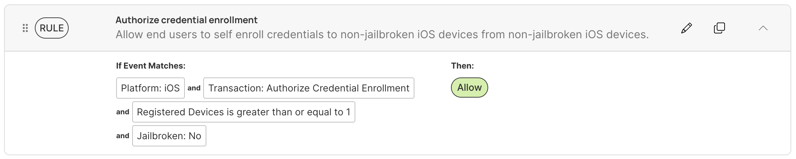

## Overview

Credential enrollment is the process of taking a trusted device with its passkey and extending the passkey to another device. End users enrolled in Beyond Identity can extend existing passkeys to their devices on their own.

Users enroll a credential on a device to then login to work applications on that device. Administrators authorize the activity of enrolling the credential on the new device.

Policy and rules help manage credential enrollment for end users. With policy and rules, administrators can restrict and limit this functionality based on attributes related to users, groups, devices, integrations, version control, location, and authentication behavior.

## Use credential enrollment rules

When end users perform a self enrollment for their credential extension, the operation triggers two policy evaluations. The policy event transaction type is `Authorize Credential Enrollment`. This policy event has one for the device that has a passkey and one for the device to receive the passkey.

To allow credential extension, confirm the two policy evaluation processes are both for the **Allow** rule definition. This means that the policy rule must match both the source and target devices to complete the successful credential enrollment.

For example, the following rule defines **For any transaction** as `Authorize Credential Enrollment` and **Then** as **Allow** to allow all Credential Extension operations for any user in the organization.

## Credential enrollment policy considerations

Authorizing self enrollment for end users helps end users maintain additional devices, passkeys, or both if a primary device no longer has a passkey. This functionality for the transaction `Authorize Credential Enrollment` is set to **Deny** by default for organizations as a best practice in security for policy evaluations.

### Available policy matching attributes

For credential enrollment operations, all policy attributes are available within the Policy Editor in the Beyond Identity Console. These attributes are evaluated in the order they are defined.

- User: has registered device(s), in user groups
- Device platform: Android, ChromeOS with Android PA, iOS, Linux, macOS, Web Authenticator, Windows
- Integration
- Authenticator version: Version, IP is new to users in the last year
- Location: In or Not in
- Behavior: Days since last authentication

### Available policy decisions

The credential enrollment policy definitions execute the decision at the end of the rule. This is defined as actions after the **Then** section of the Edit rule page in the **Policy Editor**.

- Allow
- Allow W/ OS Verification
- Allow W/ Biometric Verification
- Monitor
- Deny

## Example credential enrollment policy

The following policy rule demonstrates the allowed credential enrollment for non-jailbroken iOS devices. View the bulleted list for descriptions of each event attribute definition.

- Platform: iOS → Apple iOS devices only
- Transaction: Authorize Credential Enrollment → Self enrollment operation for end users
- Registered Devices is greater than or equal to 1 → Must have at least one registered device to the Identity
- Jailbroken: No → Cannot have a jailbroken iOS device

When an end user matches all the rules defined above, then the end user is allowed to enroll their credential to a new iOS device from within the Beyond Identity policy.

## Additional resources

For credential enrollment for end users, view more information in the guide below.

- [Self Enrollment Guide](/docs/end-user-guides/self-enrollment)