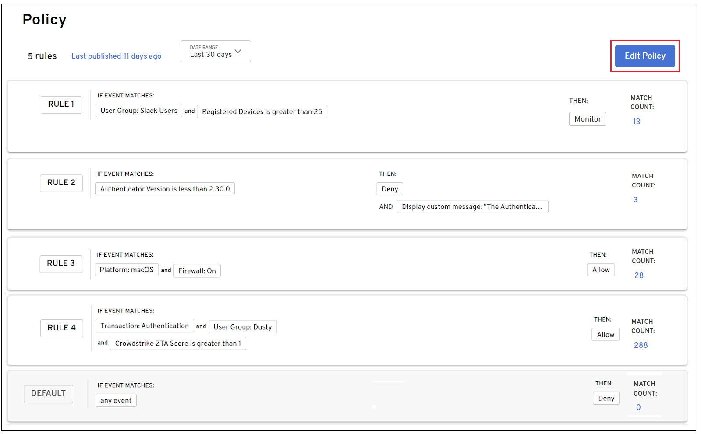
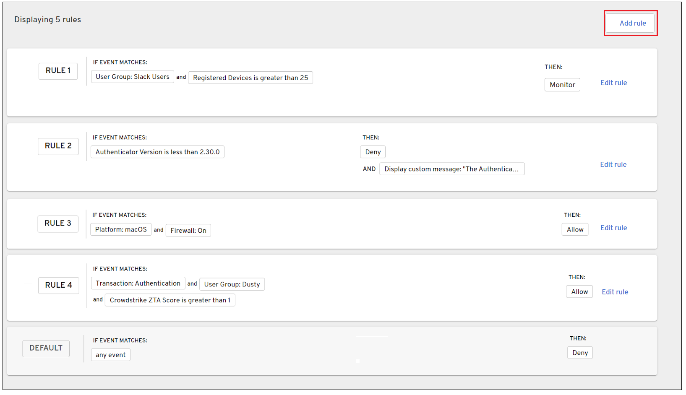
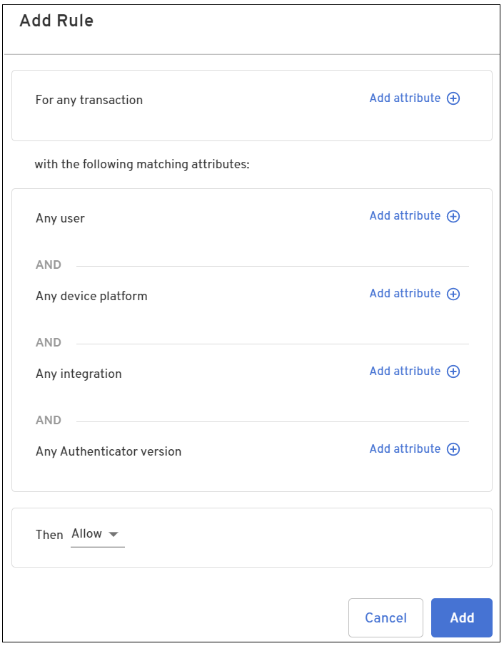

import NotePolicyMustBePublished from '../../static/includes/_note-policy-rule-must-be-published.mdx';
import PolicyShortDescription from '../../static/includes/_policy-short-description.mdx';

<PolicyShortDescription />

This article provides examples of creating rules that apply to a specific transaction type or all types. For example, you can set a policy for a specific transaction type, such as an authentication or device transaction rule. You can also set a policy for all transaction types, like denying authentication. 

## Best practices

Keep the following in mind when creating rules:

- Policy rules can be edited and deleted. However, you cannot delete the last remaining policy rule in a set. You can only edit it.

- You cannot delete the default rule denying authentication and device add.

- Only attributes and options applicable to your selected item are available. For example, Android attributes and options are not available when defining a rule for a Mac device.

## Create a rule

1. Log into the [Admin console](../Admin_Console.htm) and from the Home screen, select the **Policy** tab.

2. The [Policy page](#Policy_page) displays a list of current rules that have been configured. Click **Edit Policy.**  

  

3. From the **Edit Policy** page, click **Add Rule**. 

  

4. The **Add Rule** dialog is displayed. 

    

  The Add Rule dialog provides attributes for setting policy related to the following:

  - Type of transaction

  - User attempting to authenticate

  - Platform on the device

  - Type of integration

  - Beyond Identity Authentication version installed

:::info note
The **user**, **device platform**, and **integration** attributes can be defined with additional sub attributes.
:::

## Transaction-specific rules

The following section provides examples for writing:

- Authentication transaction rule

- Device transaction rule

### Authentication transaction rule

This example creates a rule allowing access to users that are part of the Admin Group and are authenticating from an Android device registered with Intune and running an Authenticator version greater than version 2.49.0.

1. Log into the Admin console and select **Policy > Edit Policy**.

2. Click **Add rule** and select the attributes that are required for authentication for your organization. Then click **Add**.

  <table width="100%">
  <tbody>
    <tr>
      <td>
        For any transaction
      </td>
      <td><b>Authentication</b>
      </td>
    </tr>
    <tr>
      <td>If user
      </td>
      <td><b>is in user group</b> <b>Admin Console Access</b>
      </td>
    </tr>
    <tr>
      <td>If device platform is
      </td>
      <td><b>Android</b>
      </td>
    </tr>
    <tr>
      <td>If integration is
      </td>
      <td><b>Intune</b> <b>Registration</b> <b>is</b> <b>Registered</b>
      </td>
    </tr>
    <tr>
      <td>If authenticator version
      </td>
      <td><b>is greater than</b> <b>2.49.0</b>
      </td>
    </tr>
    <tr>
      <td>Then
      </td>
      <td><b>Allow</b>
      </td>
    </tr>
  </tbody>
  </table>

  

  The rule is added to the Policy Rules list. 

  

5. Create additional rules as needed.

<NotePolicyMustBePublished />

### Device transaction rule

1. Log into the Admin console and select **Policy > Edit Policy**.

2. Click **Add rule** and select the attributes that are required for authentication for your organization. Then click **Add**.

  <table width="100%">
    <tbody>
      <tr>
        <td>
          For any transaction
        </td>
        <td><b>Add Device</b>
        </td>
      </tr>
      <tr>
        <td>If user
        </td>
        <td><b>Any user</b>
        </td>
      </tr>
      <tr>
        <td>If device platform is
        </td>
        <td><b>iOS</b>  AND <b>Device Jailbreak is</b> <b>Not Detected</b>
        </td>
      </tr>
      <tr>
        <td>If integration is
        </td>
        <td><b>JAMF</b> <b>Connection is</b> <b>Available</b>
        </td>
      </tr>
      <tr>
        <td>If authenticator version
        </td>
        <td><b>is greater than or equal to</b> <b>2.51.0</b>
        </td>
      </tr>
      <tr>
        <td>Then
        </td>
        <td><b>Allow</b>
        </td>
      </tr>
    </tbody>
  </table>

   

  The rule is added to the Policy Rules list. 
  
  

<NotePolicyMustBePublished />

## All transaction type rules

In addition to setting policy for a specific transaction type, you can set policy that applies for all transaction types. The following provides an example that writes a policy that denies authentication for any transaction type that matches the criteria set in the policy.

### Deny authentication

This example creates a rule that denies users from the QA Group attempting to authenticate or add a device that is installed with an Authenticator version less than 2.49.0.

1. Log into the Admin console and select **Policy > Edit Policy**.

2. Click **Add rule** and select the attributes that are required for authentication for your organization.

  <table width="100%">
    <tbody>
      <tr>
        <td>
          For any transaction
        </td>
        <td><b>Any</b>
        </td>
      </tr>
      <tr>
        <td>If user
        </td>
        <td><b>is in user group</b> <b>QA Group</b>
        </td>
      </tr>
      <tr>
        <td>If authenticator version
        </td>
        <td><b>is less than</b> <b>2.49.0</b>
        </td>
      </tr>
      <tr>
        <td>Then
        </td>
        <td><b>Deny</b>
        </td>
      </tr>
    </tbody>
  </table>

4. Add an optional message that is displayed to inform the user why the authentication or device add function was denied. 

  For example, *The Authenticator version installed on the device is below the minimum allowed. Please upgrade your Authenticator version to 2.49.0 or greater.*  

  

5. Click **Add** when done.  

  

6. Create additional rules as needed.

<NotePolicyMustBePublished />