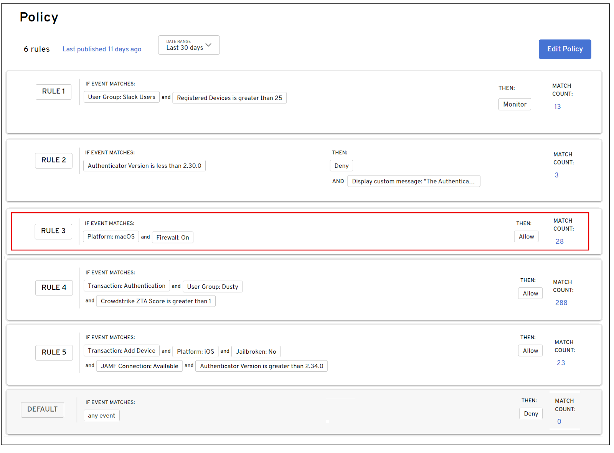

Beyond Identity provides an extensive rule-based decision policy engine that allows you to customize access decisions based on a variety of attributes from various sources, such as user, device, event, and from third party integrations.

To allow or restrict access to devices and apps, you write policy rules. Policy rules can be configured to allow or restrict access based on user, device, and event behavior. This ensures that users attempting a specific transaction, such as authenticating to web apps or adding a device, must meet the policy rule requirements that have been defined to gain access. Policy can be leveraged for a variety of use cases. For example, a company may enforce a policy that requires a firewall turned on, management software installed, or a specific operating system installed on devices to authenticate and allow access.

You can create rules that apply to all transactions that occur or for a specific transaction type. Transaction types include:

- Authentication

- Device Add

Authentication transactions include rules to authenticate to web apps or SSO providers integrated with Beyond Identity. Device Add transactions include rules related to end users’ ability to add additional devices. Rules can be written for a specific transaction type as well as across transaction types.

Until a rule allowing access is defined, access is denied. Any number of rules can be added. A single rule can consist of any number of transaction-based attributes related to the following:

- User

- Device

- Integration

- Authentication version

When a transaction is initiated, each defined rule is evaluated in numerical order. Once an exact rule is found, access is allowed or restricted based on the criteria defined in the rule. No further searching through the remaining rules is necessary. If a match is not found after searching through all rules, the default deny rule is matched and access is denied.

For example, a rule has been defined allowing access when authenticating from a macOS device that has a firewall turned on. The Policy engine searches through the rules starting with Rule 1 and when it finds a match, it stops searching and allows access. In this example, a match is found in Rule 3. The Policy engine does not need to continue searching through the remainder of the rules.

