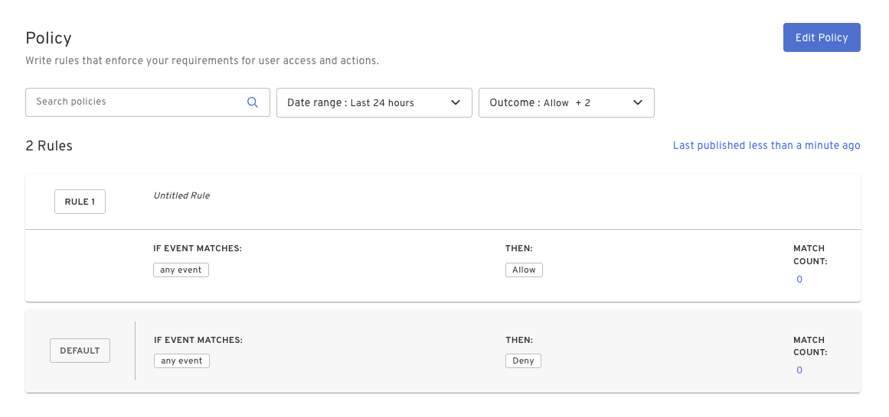

In addition to passwordless, unphishable authentication and MFA, Beyond Identity’s policy engine enables administrators to write custom Zero Trust Access rules for apps and devices configured to authenticate with Beyond Identity.

Zero Trust Access rules can be written to make access decisions based on attributes of the User, Device, Transaction, Risk, and information from third party integrations. This allows organizations to make granular, automated decisions on access to critical applications, devices, and data based on the organization’s security policy.

Navigate to Policy in the Admin Console to view and manage policy rules for your organization. The default policy for a tenant permits active users and devices with a valid passkey to authenticate and perform Beyond Identity transactions. Write policy rules to begin monitoring and enforcing security policy.

## Writing policy rules

### Policy evaluation

Policy rules are evaluated in 

Base Posture Checks

Windows
- OS Version
- Firewall
- Encryption
- AntiVirus
- CVE Count

macOS
- OS Version
- Firewall
- Encryption
- AntiVirus
- Password Set
- CVE Count

Android
- Rooted
- Authentication Enabled
- CVE Count

iOS
- Jailbroken
- Authentication Enabled
- CVE Count
