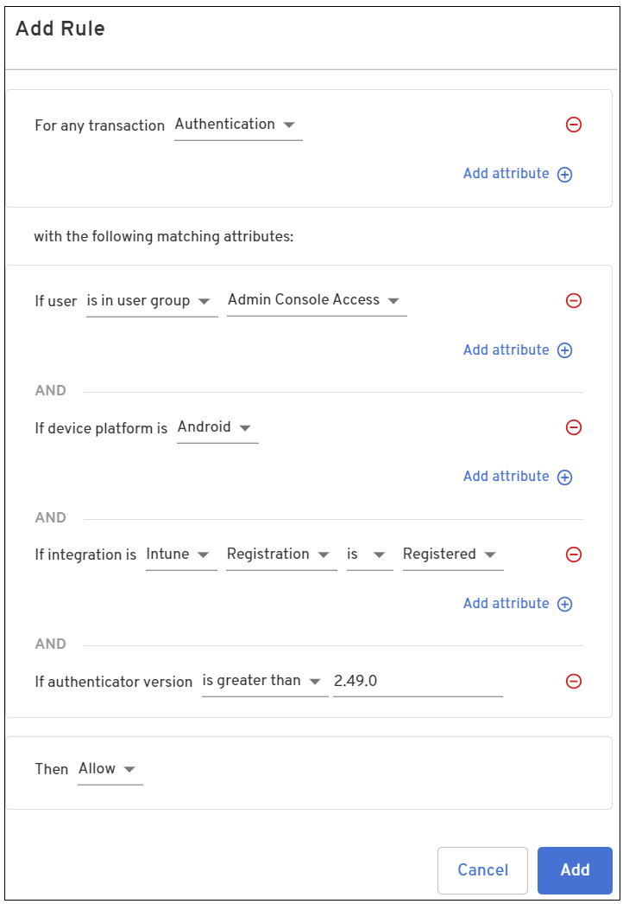
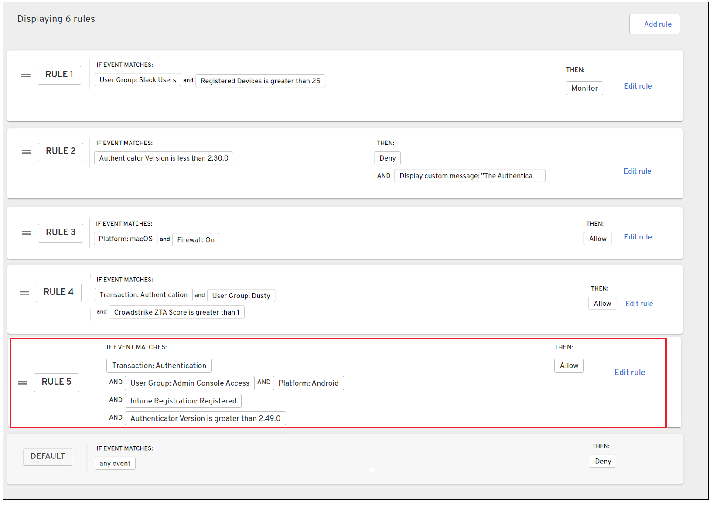
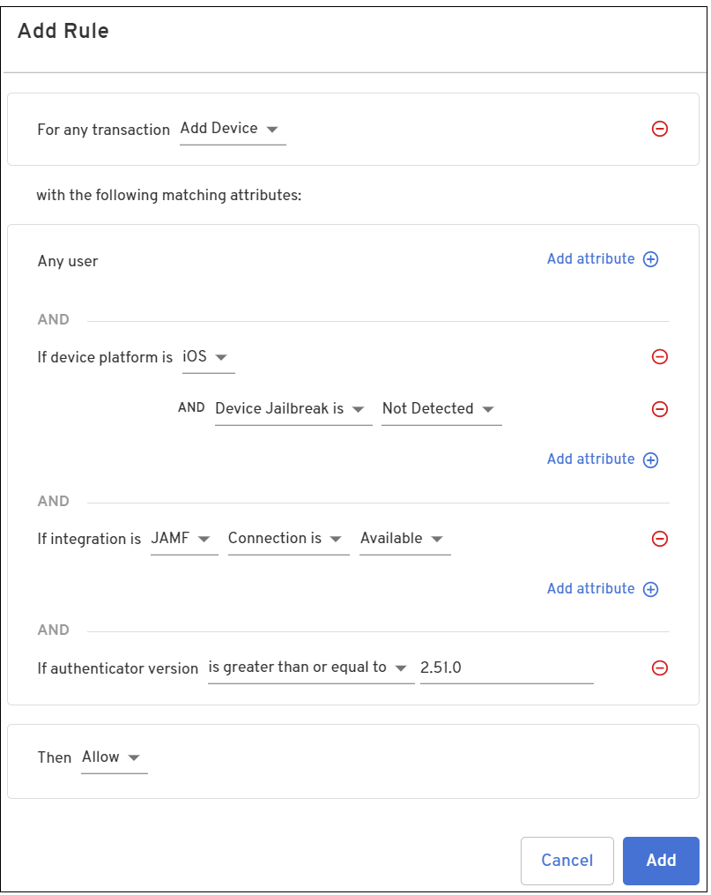
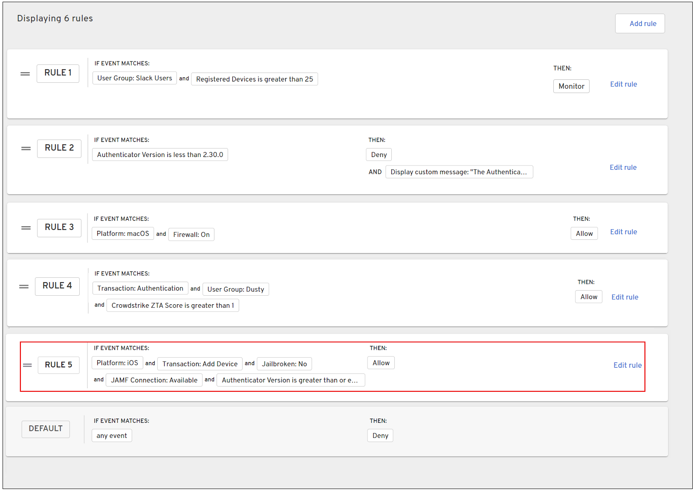

## Transaction-specific rules

The following section provides examples for writing:

- Authentication transaction rule

- Device transaction rule

### Authentication transaction rule

This example creates a rule allowing access to users that are part of the Admin Group and are authenticating from an Android device registered with Intune and running an Authenticator version greater than version 2.49.0.

1. Log into the Admin console and select **Policy > Edit Policy**.

2. Click **Add rule** and select the attributes that are required for authentication for your organization. Then click **Add**.

  <table width="100%">
  <tbody>
    <tr>
      <td>
        For any transaction
      </td>
      <td><b>Authentication</b>
      </td>
    </tr>
    <tr>
      <td>If user
      </td>
      <td><b>is in user group</b> <b>Admin Console Access</b>
      </td>
    </tr>
    <tr>
      <td>If device platform is
      </td>
      <td><b>Android</b>
      </td>
    </tr>
    <tr>
      <td>If integration is
      </td>
      <td><b>Intune</b> <b>Registration</b> <b>is</b> <b>Registered</b>
      </td>
    </tr>
    <tr>
      <td>If authenticator version
      </td>
      <td><b>is greater than</b> <b>2.49.0</b>
      </td>
    </tr>
    <tr>
      <td>Then
      </td>
      <td><b>Allow</b>
      </td>
    </tr>
  </tbody>
  </table>

  

  The rule is added to the Policy Rules list. 

  

5. Create additional rules as needed.

<NotePolicyMustBePublished />

### Device transaction rule

1. Log into the Admin console and select **Policy > Edit Policy**.

2. Click **Add rule** and select the attributes that are required for authentication for your organization. Then click **Add**.

  <table width="100%">
    <tbody>
      <tr>
        <td>
          For any transaction
        </td>
        <td><b>Add Device</b>
        </td>
      </tr>
      <tr>
        <td>If user
        </td>
        <td><b>Any user</b>
        </td>
      </tr>
      <tr>
        <td>If device platform is
        </td>
        <td><b>iOS</b>  AND <b>Device Jailbreak is</b> <b>Not Detected</b>
        </td>
      </tr>
      <tr>
        <td>If integration is
        </td>
        <td><b>JAMF</b> <b>Connection is</b> <b>Available</b>
        </td>
      </tr>
      <tr>
        <td>If authenticator version
        </td>
        <td><b>is greater than or equal to</b> <b>2.51.0</b>
        </td>
      </tr>
      <tr>
        <td>Then
        </td>
        <td><b>Allow</b>
        </td>
      </tr>
    </tbody>
  </table>

   

  The rule is added to the Policy Rules list. 
  
  

<NotePolicyMustBePublished />

