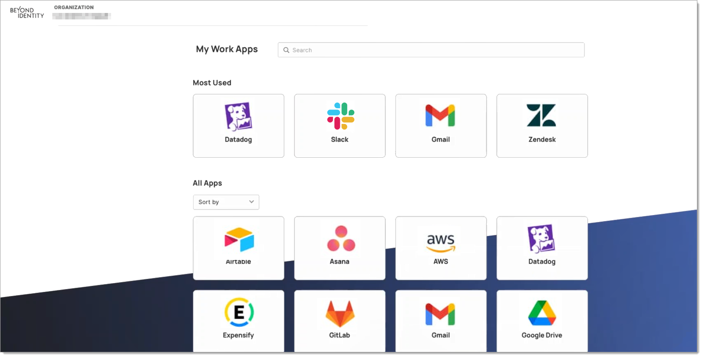

## What is Beyond Identity Secure SSO?

Secure SSO is the first SSO to be built, from the ground up, for zero trust that will transform the way you access services. Going beyond legacy SSOs, our SSO is secure by default without complex configurations, optimized for zero trust architectures, extends risk-based authentication on a per-application level, and aims to enable zero standing privileges. In addition to the security features, our SSO currently supports a federated directory, OIDC, and SAML applications, a customizable application launcher, and additional administration and end-user UX improvements. 

- **Simplicity at its Core:** A streamlined, intuitive user experience that makes access easy.
- **Unmatched Security:** Leveraging the latest in security protocols to ensure your data remains safe and sound.
- **Accelerate Productivity:** Enables end-users to login to their apps with a single frictionless, passwordless user experience.
- **Future-Ready:** Designed to evolve with your needs, ensuring longevity and adaptability.

**Get a demo:** https://www.beyondidentity.com/solutions/secure-sso

## Worried about migration? 
We recognize that migrating SSOs is not a trivial task for most organizations. To that end, we are expanding the capabilities of [Access360](access360.mdx). Access360 is a tool that today allows you to scan your Okta configuration to identify vulnerable authentication paths. In its soon-to-come iteration, Access360 will surface insights from your legacy SSO and turn that into migration guidance within the Beyond Identity Admin console.