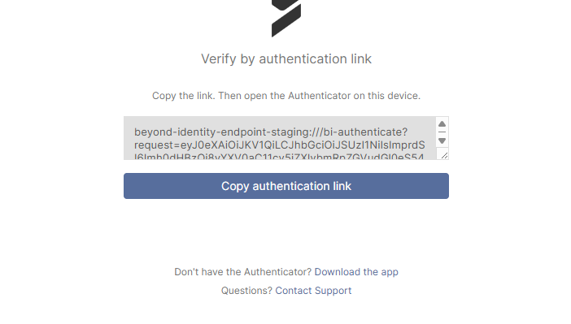

## Secure Access Release Notes

Secure Access release notes are published biweekly for commercial deployments in both the US and EU. FedRAMP and government environments receive updates two weeks after features are released to commercial deployments.

### October 25, 2025

  

Secure Access Release Notes

Beyond Identity began deployment of a new **Secure Access** software release on October 25, 2025. 

 

### What's New

- **Granular Roaming Authentication Configuration**
  Secure Access now supports granular configuration for roaming authentication. Administrators can define allowed **source IP addresses**, **users**, and **user groups** in addition to existing realm-level enablement. This enhancement offers finer control over authentication behavior for roaming users. For documentation, [click here](https://docs.beyondidentity.com/docs/authentication-experience/roaming-authentication/roaming-authentication-config).
   

     

 
- **Tenant Selection Prompt in Secure Access Console**
  When logging into the Secure Access console, users are now prompted to select a tenant if the tenant name they enter matches more than one tenant. This enhancement helps ensure users are directed to the correct tenant when duplicates exist.
   

     

 

- **Support for TPM Policy Rules (AAL3 Compliance)**
To meet the Authenticator Assurance Level 3 (AAL3) requirements defined by NIST, Secure Access now supports authoring Windows and Linux TPM policy rules. This enhancement enables administrators to build policies that verify Trusted Platform Module (TPM) attestation as part of authentication requirements.

 

### Enhancements

- **Configurable Launch Mechanisms at Realm Level**  
  Secure Access now allows configuration of launch mechanisms, such as enabling or disabling **authentication URL copy-paste** and other app behaviors, at the **realm level**. This enhancement gives administrators greater control and parity with the existing tenant-level configuration options in Secure Work. This feature is primarily an **API-first experience**. Default launch mechanism settings are automatically created for each tenant or realm, but administrators can update these configurations through the API.  

  When this mechanism is configured — for example, enabling the **copy** flow type — end-users will see an **authentication URL copy-paste box** (as shown in the authentication link prompt) when verifying their identity via the Beyond Identity Authenticator.  

  **Note:** Copy functionality is **disabled by default** for all tenants, as it is considered a less secure option.

    

- **Updated CrowdStrike API for Device Posture Data**  
  Secure Access now uses an updated **CrowdStrike API** designed for improved stability and accuracy in device posture reporting. This enhancement increases the reliability of policy decisions that depend on device health signals.  

- **Restriction on Super Administrator Role Editing**  
  As part of the upcoming capability for tenants to create custom roles in Secure Access, the initial **Super Administrator** role is now managed exclusively by Beyond Identity and can no longer be edited by end users. This change prevents accidental modifications that could impact platform functionality or access.  

  For full documentation on creating roles, [click here](https://docs.beyondidentity.com/docs/directory/role-management/create-roles).  
  

 

### Bug Fixes

- **Improved Policy Event Logging**  
  Some previously missing details in policy event logs are now correctly populated. Policy Create, Update, and Delete events now display the actor in the event log. For certain system-initiated events (create and delete), the **Actor** field will display as *system* or *Beyond Identity*, depending on context. This improvement provides clearer visibility into which actions are performed automatically versus manually by administrators.  

- **Fixed Missing Platform Icons on Authenticator Downloads Page**  
  Resolved an issue where platform icons were not appearing on the **Platform Authenticator downloads** page. Icons now display correctly for all supported platforms.  

 
 

### October 19, 2025

  

Secure Access Release Notes

## Hot Fix Release

**Improved Reliability of Threat Signal Publishing**  
Fixed an issue that caused some event signals to not be published to certain SIEM integrations. The update improves the reliability and stability of the threat-signals service to ensure all events are consistently delivered.

 

 

### October 15 & 16, 2025

  

Version 2.107.9 BI Authenticator Release Notes

## Hot Fix Release

| **Platform** | **Type** | **Description** |
|--------------|-----------|-----------------|
| Android | Bug | Resolves an issue where Android’s Login Service occasionally timed out during authentication, ensuring stable and consistent login behavior across managed and unmanaged devices. |
| Android / iOS | Enhancement | Improves markdown support in custom policy messages displayed via toast notifications, ensuring consistent rendering for links, bold, and italic text. |
| Android / iOS | Enhancement | Standardizes the display of custom policy messages to ensure a uniform look and feel across devices, improving overall user experience and reducing layout inconsistencies. |
| Android / iOS | Bug | Resolves an issue on Android 15 and 16 where toast messages were not displaying correctly during self-remediation flows. Toasts now appear as expected in all supported Android versions. |
| Android | Bug | Resolves an issue on Android 15 and 16 where the Login Service could crash after a complete reboot. This change aligns with new startup behavior now required and enforced by Google, improving post-reboot reliability and compliance. |
| Android / iOS / macOS / Windows | Bug | Standardizes the display of toasts, markdown, and dismiss behavior across all platforms (Windows, macOS, iOS, Android) for improved consistency. |
| Windows | Bug | Fixed an initialization issue where the Windows Platform Authenticator could hang when attempting to authenticate immediately after logging in. The startup sequence has been improved for stability. |

 

 

### October 2, 2025

  

Secure Access Release Notes

## Hot Fix Release

#### Policy Evaluation Page Fix
Resolved an issue where the **Policy Evaluation** tab under **Policy** did not display detailed evaluation information. This fix restores full visibility into evaluation details, ensuring admins can properly review and troubleshoot policy outcomes.

 
Previous state before the bug fix:

    

 
After the bug fix, you can now see policy evaluation details:

    

 

 

### September 26, 2025

  

Secure Access Release Notes

  ## Hot Fix Release

| Platform | Description |
| -------- | ----------- |
| Android / Chrome | Fixed an issue where certain Android devices, including Google Pixel models, failed to authenticate in Chrome due to corrupted data payloads generated by the browser. |
| Chrome v141 | Updated support for Chrome v141 to reflect Google’s changes to the Local Network Access feature, ensuring users only encounter the new access prompt once per device. For documentation on this, please [click here](https://docs.beyondidentity.com/docs/resources/announcements/chrome-browser).   |

 

 

### September 23, 2025

  

Secure Access Release Notes

## Hot Fix Release

| PLATFORM | TYPE | DESCRIPTION |
| -------- | ---- | ----------- |
| Secure Access | Enhancement | **Passkey Management Enhancements**  We’ve improved the Passkeys view in the Secure Access admin console to provide better visibility and easier management for admins and support staff.  **What Changed** - Added new identifying details for each passkey, including: &nbsp;&nbsp;• Platform &nbsp;&nbsp;• Version &nbsp;&nbsp;• Device name &nbsp;&nbsp;• Serial number - Rearranged existing columns to improve information visibility and streamline support workflows.  **Note**: The new columns will populate with data after the passkey is next used for authentication.  **Why This Matters** These enhancements address customer feedback that the previous passkey view lacked sufficient detail to distinguish between individual passkeys. By providing richer metadata, admins can now: - More easily identify and manage passkeys during rollout and ongoing support. - Troubleshoot authentication issues with greater clarity. |
| Secure Access | Enhancement | **Passkey Metadata Enhancements in Admin Console**  We’ve improved the passkey management interface to give admins and support staff more detailed device information.  **New Columns Added**: - **Platform** (Windows, Linux, macOS, iOS, Android) - **Version** (OS or API level, depending on platform) - **Device Name** - **Serial Number**    **Dynamic Updates**: These fields now populate after a user successfully authenticates with the Platform Authenticator. If a user later upgrades their OS, the **Version** column will update automatically on their next successful authentication.  **Improved Troubleshooting and Support**: Provides better visibility into enrolled devices, streamlines support processes, and aligns with Secure Work’s metadata display.  **Notes**: - “Not supported” will appear if the platform does not expose a specific field or if configuration prevents data sharing (e.g., iOS/Android only provide serial numbers when MDM-managed). - On Android, the **Version** column reflects the **API Level**, not the OS version. - On Windows, the **Version** column is the internal version reported by Windows (e.g., `10.0.22000` = Windows 11). |

 

 

### September 17, 2025

  

Version 2.107.1(2) BI Authenticator Release Notes

## Hot Fix Release

| Platform | Description |
| -------- | ----------- |
| Android | **Android Login Service**  On Android 15 and 16, an issue was resolved where the Login Service could crash after a timeout, typically following about six hours of inactivity. This behavior is newly required and enforced by Google. In accordance with the latest Android platform requirements, foreground services now require an end-user interaction with the application to be initiated. This update ensures compatibility and a stable user experience. It is recommended that users upgrade to v2.107.1.  **Impact on End-Users:** This change may affect authentication flows. In some scenarios, where the app previously launched automatically to detect and handle an authentication flow, end-users may now be required to manually launch the app to complete the process. |

 

 

### September 15, 2025

  

Version 2.107.1 BI Authenticator Release Notes

## Hot Fix Release

| Platform | Type | Description |
| -------- | ---- | ----------- |
| Windows | Bug | **Windows Platform Authenticator Issue**  Beyond Identity Platform Authenticator, version 2.107.0, released earlier this week, was rolled back on September 11 after an installation issue was identified. Version 2.107.1 includes the fix and is now being redeployed to all customers.  **What Changed** Resolved an issue affecting **User installs** during upgrades where: • The Platform Authenticator would not automatically start during authentication or user login. • Start Menu items could be missing.  **Impact** • Customers with User installs who experienced these issues during upgrades from older versions should see them resolved with v2.107.1. • **System installs were not affected.** • No action is required for customers who remained on the prior stable version. |
| macOS | Bug | **Alert Dismissal on macOS 26 Beta** Resolved an issue where an alert displayed by the Platform Authenticator could not be dismissed. While macOS 26 is not yet generally available, we are proactively addressing this issue to ensure compatibility when the OS update is released.  **Proxy Auto-Detection Behavior** Fixed a case where, in certain scenarios, proxy auto-detection could cause unwanted behavior. The Platform Authenticator now correctly handles cases where the operating system reports an invalid URL for proxy settings. |
 

 

 

### September 11, 2025

  

BI Authenticator Release Notes

We identified an issue during the update installation process in version **2.107.0** of the Windows Platform Authenticator. The issue primarily affected customers who performed self-installs (per-user installs). Out of an abundance of caution and to ensure stability and continuity for all customers, we have rolled back the release.

 
### What Changed
- Rolled back version **2.107.0** for all customers.

 
### Impact
- **If you have already deployed version 2.107.0 and are experiencing no issues, there is no further action required at this time.**  
- Customers who performed self-installs may have temporarily experienced update issues following the **2.107.0** deployment.

 
### Next Steps
- A corrected version will be redeployed once fixes are verified and tested.

 

 

### September 10, 2025

  

Version 2.107.0 BI Authenticator Release Notes

Beyond Identity began deploying its Platform Authenticator v2.107.0 on September 10, 2025. 

 

### What's New

| PLATFORM | FEATURE DESCRIPTION |
| -------- | ------------------- |
| Windows  | <strong>Desktop login with YubiKeys and Web SSO (Available only in Secure Work)</strong>  Beyond Identity now integrates with Microsoft Windows to allow secure, passwordless desktop login using YubiKeys, a hardware security key that protects against phishing attacks and other credential-based threats.  For a list of approved YubiKeys and configuration steps, [click here](https://support.beyondidentity.com/hc/en-us/articles/32621659512343-How-to-Configure-and-Manage-YubiKey-User-Enrollment-for-Windows-Desktop-Login-2-0-End-User).  Users can now leverage phishing-resistant PIV smartcard login to Windows and extend it to SSO and apps, enforcing that access only happens from compliant devices.  Note: This feature is available with Beyond Identity Platform Authenticator version 2.107 or later. |

 

### Enhancements

| PLATFORM        | ENHANCEMENT DESCRIPTION |
| --------------- | ----------------------- |
| Windows         | **Reduced installer size**  The Windows System installer has been optimized to use less disk space and download size. Duplicate .NET 8 libraries were consolidated, and installation now uses the smaller, on-demand WebView2 installer. This makes installation faster and more efficient while keeping all functionality intact. |
| Windows and macOS | **Auto Proxy enabled by default**  The Auto Proxy feature is now enabled by default, simplifying setup for environments that use proxies. |

 

### Bug Fixes

| PLATFORM        | BUG FIX DESCRIPTION |
| --------------- | ------------------- |
| All Platforms   | **Credential re-import sync**  Fixed an issue where re-importing the same credential did not properly sync with the cloud. Beyond Identity Authenticator now keeps credentials consistent across device and cloud. |
| Windows         | **High DPI icon fixes**  Corrected an issue where TaskBar and TaskTray icons did not display properly on high-DPI monitors and laptops. Icons now scale correctly on high-resolution displays. |
| Windows         | **System installer stability**  Improved reliability of Windows System installers, especially when deployed with MDM tools such as Intune or SCCM. The update prevents incorrect downgrades when only the fourth version digit differs, blocks conflicting installs from multiple channels, and resolves corruption issues caused by partial installs. |
| Windows         | **Proxy detection reliability**  Fixed an issue where proxy detection on Windows could fail intermittently. Proxy settings are now detected and applied more consistently, ensuring stable network connections. |
| Android         | **Scrollable deny messages**  Custom policy deny messages are now scrollable, making long messages easier to read without being cut off. |
| Android         | **Accessibility Service crash fix**  Fixed an issue where WebViews (such as “View third-party licenses” in “About Beyond Identity”) could crash while running on Android 9.0+. WebView now assigns a unique data directory suffix per process, preventing these conflicts and runtime crashes. |
| Android         | **Login Service stability fix**  Fixed an issue where Android’s Login Service could occasionally crash in the background on Android 12+. This was caused by a race condition (a timing conflict between the operating system and the service). Although the service recovered automatically, the OS still displayed a crash pop-up. |

 

 

### September 3, 2025

  

Secure Access Release Notes

## Hot Fix Release 

### Bug Fix

#### **Added support for handling extra characters in the `SAMLRequest` parameter during Service Provider (SP)-initiated flows.**  

The `SAMLRequest` parameter is the login request that a service provider (such as Cisco WebEx) sends to an identity provider during an SP-initiated SAML flow. Some WebEx configurations include non-base64 characters in this request. This enhancement ensures those requests are processed correctly, improving reliability for WebEx integrations.

 

 

### August 27, 2025

  

Secure Access Release Notes

## What's New

#### Realm Management
Realms created in the Secure Access console for Secure Work and Secure Customer can now be edited or deleted.
 

#### Shortened SAML URLs for Cisco Compatibility  

We’ve added a new option to generate shortened SAML URLs to support Cisco products that enforce a 128-character limit on entity IDs and URLs.
 
      - Admins can now enable a toggle to generate shorter **SP-initiated URLs** and **Issuer URLs**.  
      - This resolves configuration issues when setting up SAML apps for **Cisco VPN** and **WebEx Admin Portal**.  
 
With this improvement, you can configure SAML applications for Cisco firewalls and services without hitting the 128-character restriction.  

 
## Bug Fixes

#### Authenticator Download Links (FedRamp)
- Fixed incorrect download links for the Beyond Identity Authenticator during Secure Access setup in government environments. This change is not needed for commercial environments.
 
#### Policy Editor Action Icon
- Fixed a CSS issue where the Action icon was hidden for policy rules with long descriptions, preventing edits or copies.
 
#### Integration Field Validation
- Added character limits for integration names and descriptions to improve security.
 
#### Realm Updates Visibility
- Fixed an issue where realm updates (create, rename, delete) were not immediately reflected in the console. Changes now appear without requiring a page refresh. **Note**: Multi-realm support for Secure Work realms in Secure Access remains limited.
 
#### OIDC Discovery Endpoint
- Corrected an issue where OIDC applications displayed the wrong discovery endpoint URL.
 
#### Integration Input Validation
- Expanded client-side input validation on integration forms for a more consistent user experience.
 
#### Event Log Noise Reduction
- Removed unnecessary "User Authentication – UNAUTHORIZED" events that contained no meaningful details, reducing noise in admin event logs.

 

 

### August 13, 2025

  

Secure Access Release Notes

## Hot Fix Release 

### Session Termination on Role Permission Changes

Secure Access console sessions are now automatically terminated if a user’s role permissions are downgraded or if the account is suspended. Actions that can trigger session termination include:   
 
  - Removing a user, or a group the user belongs to, from a role  
  - Removing permission scopes from a role the user is assigned to directly or through a group  
  - Deleting a role the user is assigned to directly or through a group   
 
When a session is terminated due to a role permission change, the console will redirect to the login screen with a message indicating that the logout was caused by updated role permissions. Users who have not been suspended can log back in immediately, and their new session will reflect the updated role permissions.

 

 

### August 11, 2025

  

Secure Access Release Notes

## What's New

**New Beyond Identity Logo**  
Beyond Identity unveiled a refreshed logo design on August 11 as part of our company rebrand. Customers will see the updated logo across the RealityCheck, Secure Work, and Secure Access platforms, as well as on both documentation portals. This update is visual only and does not impact platform functionality or user workflows. We’re excited to share this next chapter of our brand with you.
 

 

 

### August 6, 2025

  

Version 2.106.1-2 BI Authenticator Release Notes

Beyond Identity began deploying its Platform Authenticator **v2.106.1-2** on August 6, 2025. This release includes an enhancement.

## Enhancements

| OPERATING SYSTEM | DESCRIPTION |
| ---------------- | ------- |
| Windows | **Windows Platform Authenticator 2.106.1-2 Hot Fix Release**  The 2.106.1-2 release of the Windows Platform Authenticator is identical to version 2.106.0 (originally released on July 30, 2025). We are issuing a new build because version 2.106.0 was removed from our website on August 5, 2025, after being incorrectly flagged as a false positive by Microsoft Defender.  Since Microsoft Defender SmartScreen rule updates can take several hours to propagate, we chose to release a new build (2.106.1-2) rather than re-publish the flagged 2.106.0. |

 

 

### July 30, 2025

  

Version 2.106.0 BI Authenticator Release Notes

  
    Beyond Identity began deploying its Platform Authenticator v2.106.0 on July 30, 2025. This release includes enhancements and bug fixes.

     

<h3>Enhancements</h3>
 

| Operating System | Feature |
|------------------|---------|
| Windows, macOS, Android, iOS | **Faster Onboarding for Users with Registration Codes** We removed an extra step during onboarding for users registering a Secure Access and Secure Work credential. Previously, users with a 9-digit registration code were required to click an additional button to enter the code. This step has been eliminated to streamline the process. |
| Windows | **Updated Windows Desktop Login Process** - *Not available for Secure Access*  We’ve improved the fingerprint enrollment experience for Windows Desktop Login to better align with Windows Hello requirements. The updated flow now intelligently adapts based on your system setup. For example, whether Windows Hello is enabled, if a PIN has been created, or if a fingerprint reader is available. We’ve also made it easier to access the fingerprint enrollment option within your passkey settings.|

 

<h3>Bug Fixes</h3>
 

| Operating System | Fix |
|------------------|-----|
| **Windows** | **Authentication Hang at Startup Resolved** We've fixed an issue that could cause the Windows Platform Authenticator to freeze if launched right after system startup. |
| **Windows** | **WebViewHelper Resource Usage Optimized** We've resolved an issue where multiple instances of WebViewHelper could run at the same time, unnecessarily consuming system resources. The update improves system performance and stability during authentication. |
| **Windows** | **Authentication Stability Improved** We addressed a rare timing issue that could cause authentication to fail when the same request was processed by multiple components. This fix improves reliability and reduces the chance of unexpected failures during authentication. |
| **Android, iOS** | **Roaming QR Code Scanning Fixed** We've resolved an issue that was preventing the app from recognizing and responding to Roaming QR codes. You can now scan these QR codes directly within the app’s camera screen, and it will correctly open the browser to continue the authentication flow, making sign-ins smoother and more reliable. |
| **Android** | **Android App Crash Message** Resolved a race condition that could cause the Login Service to crash in the background on Android 12+ devices. Although the service would recover automatically, the operating system reported it as a crash and displayed a pop-up notification to users. |
| **Windows, macOS, Android, iOS, Linux** | **Redundant Passkeys** Resolved an issue where re-importing the same credential on a device could result in multiple redundant passkeys appearing in the Admin Console. The system now deletes the duplicate from the cloud to ensure the number of credentials remains consistent between the device and the cloud. |

---

### July 28, 2025

  

Secure Access Release Notes

  <h4>Changes</h4>

- #### Authentication URL During Log In

  A new box displaying an authentication URL within the standard Secure Access login dialog has been removed. While the dialog window itself remains part of the normal login flow, the section removed allowed users to copy and paste the URL into their browser to complete authentication. However, we’ve temporarily removed this feature to ensure a more seamless and fully supported login experience.

 

### July 23, 2025

  

Secure Access Release Notes

  
    Here’s a summary of the latest features and improvements to the Beyond Identity Secure Access platform.

     

<h3>What's New</h3>
 

- #### Secure Access Roaming Authentication (Early Access)

    End users can now authenticate securely on devices that don’t have their passkey installed. This is ideal for shared workstations, kiosks, or virtual desktops, and provides a fast, phishing-resistant way to log in when a primary device is unavailable, broken, or lost. [More details in our user documentation](https://docs.beyondidentity.com/docs/authentication-experience/roaming-authentication).

---

<h3>Bug Fixes</h3>

- #### "Create Magic Link" Scope is Now Non-sensitive

  The `magic-links:create` scope is no longer classified as sensitive. For customers using the custom roles feature, this means you no longer need to include all scopes when assigning a role that includes this scope.

 
- #### Documentation Link for Creating Identities

  The **Getting Started** link for creating identities now directs to the correct page in the documentation.

   
   

### June 28, 2025

  

Secure Access Release Notes

  
    Here’s a summary of the latest features and improvements to the Beyond Identity Secure Access platform.

     

<h3>What's New</h3>
 

#### New Directory UI Features (**General Availability**)
We're introducing exciting new features in the **Directory** section of the platform. 

 

  - #### New Enrollment Summary Section
    A new **Enrollment Summary** now appears at the top of the **Identities** section, offering a quick snapshot of your directory. It displays key metrics such as the total number of identities, those enrolled or not enrolled, pending and failed invite attempts, and more.

      
 

  - #### Batch Enrollment Feature
    Administrators can now onboard multiple users with a new **bulk enrollment** feature. This update simplifies enrollments by enabling administrators to send up to **200 invitation emails** at a time to multiple users.

    [View user documentation](https://docs.beyondidentity.com/docs/directory/manage-users/add-users#enrolling-multiple-identities-bulk-enrollment)

 

  - #### Batch Identities Deletion Feature
    Administrators can now delete multiple identities at once with a new **bulk deletion** feature.

    [View user documentation](https://docs.beyondidentity.com/docs/directory/manage-users/delete-users#deleting-multiple-identities-in-bulk)

 

#### Multi-Realm Management Now Available (**Early Access**)
The new multi-realm feature allows administrators to manage Secure Work and Secure Customer identity directories within a single tenant, making it seamless to handle both employee and customer authentication workflows.

    View user documentation:  
    - [Secure Work Realms](https://docs.beyondidentity.com/docs/directory/realms/)  
    - [Secure Customer Realms](https://docs.beyondidentity.com/docs/directory/realms/customer-realms)

 

#### Granular Role Permission Customization (**Early Access**)
    
  Administrators can now create and assign custom roles with granular, least-privilege permissions in the Secure Access Console. Admins can define exactly which actions each role can perform, such as allowing help desk staff to reset credentials or enabling application owners to manage app assignments. This feature minimizes the number of high-privilege accounts, reduces the attack surface, insider risk, and helps meet access control requirements for standards like SOC 2, ISO 27001, HIPAA, and FedRAMP.

     [View user documentation](https://docs.beyondidentity.com/docs/directory/roles#customize-role-permissions)

---

<h3>Bug Fixes</h3>

- <h4> Eliminated Duplicate `USER_AUTHENTICATION` Events on Timeout </h4>
  Timeout scenarios no longer trigger multiple `USER_AUTHENTICATION` events. Events are now reliably emitted once per authentication attempt, improving log accuracy.

 

- #### Corrected Invalid `UNAUTHORIZED` Authentication Events
  Resolved an issue where failed authentications could produce empty or invalid `USER_AUTHENTICATION - UNAUTHORIZED` events. These events now consistently contain the correct information for auditing and troubleshooting.

 

- #### Firefox Private Browsing Login Issue
  Resolved an issue preventing logins in Firefox Private Browsing mode after configuring Okta as an identity provider (IdP). Authentication payload handling has been improved to ensure reliable login experiences.

   
   

### June 27, 2025

  

Version 2.104.0-4 BI Authenticator Release Notes

Beyond Identity began deploying its Platform Authenticator v2.104.0-4 on June 27, 2025. This release includes one new feature and a bug fix.

   

  <h4>What's New</h4>

| **Operating System** | **Feature**                         |
|----------------------|--------------------------------------|
| Windows, macOS       | Customizable Authentication Prompts |

IT administrators can now customize the informational text displayed during authentication/verification prompts on Windows and macOS desktop devices. This enhancement gives organizations the flexibility to deliver clear, context-specific guidance during the authentication process. Administrators can use the BIConfigure tool to set, retrieve, or clear this custom text, helping align prompts with internal policies, minimize user confusion, and support compliance initiatives. [Learn how to configure authentication prompts](https://support.beyondidentity.com/hc/en-us/articles/31824092042775-Configurable-User-Verification-Dialog)

 

  <h4>Bug Fixes</h4>

| **Operating System** | **Fix**                          |
|----------------------|----------------------------------|
| Windows              | Authentication Stability Improved |

We addressed a rare timing issue that could cause authentication to fail when the same request was processed by multiple components. This fix improves reliability and reduces the chance of unexpected failures during authentication.

### June 14, 2025

Secure Access Release Notes

    Here’s a summary of the latest updates and improvements to the Beyond Identity Secure Access platform to enhance your experience and security.

## Enhancements

### Console Session Behavior

- **Improved Re-Login Experience After Timeout**  
  Refined the re-login flow in the Secure Access Console for a smoother, more intuitive user experience after session timeout or logout.

- **Improved Partner Branding Stability**  
  Partner logo assets are now self-hosted in the Secure Access Console, improving branding reliability and load performance.

---

## Bug Fixes

- **Unexpected Logouts During Active Sessions**  
  Fixed an issue causing active users to be logged out unexpectedly from the Secure Access Console.

- **Region Toggle Now Works Correctly in EU**  
  Resolved a problem where the region toggle displayed incorrect information and produced invalid links in the EU Virtual Data Center (VDC). The toggle now accurately reflects the active region.

- **Repeated Logout After “Resume Activity” Prompt**  
  Fixed a bug where users were logged out even after choosing “Resume Activity” during session timeout warnings. Session timers now reset correctly with each interaction.

### May 28, 2025

  

Secure Access Release Notes

    Here’s a summary of the latest updates and improvements to the Beyond Identity Secure Access platform to enhance your experience and security.
  ## What's New

  ### Inactivity Timeout for Enhanced Security

  To help keep your data secure, the Secure Access Console now automatically logs users out after 15 minutes of inactivity. If your session times out, simply log in again to continue where you left off.

  [Learn more about session behavior](https://docs.beyondidentity.com/docs/resources/platform-information/session-behavior)

  ---

  ### Kandji + Beyond Identity Integration

  The Beyond Identity Mac Platform Authenticator (PA) is now integrated into Kandji's Auto App Collections, enabling fully automated deployment and updates via the Kandji MDM platform. This eliminates the need for IT admins to manually download and re-upload the latest version of the Mac PA, streamlining operations with zero-touch updates. By selecting options like "Continuously Enforce" and "Automatically enforce new updates," you can ensure your macOS devices will always have the latest, most secure version of the Beyond Identity Authenticator.

  [Learn more](https://docs.beyondidentity.com/docs/tools/integrations/kandji)

  ---

  ## Enhancements

  ### BI Authenticator Updates: iOS v2.103.3 (Released May 13)

  #### Streamlined Navigation After Authentication on iOS

  We've improved the post-authentication experience in our iOS app to make navigation smoother and more intuitive. After completing authentication, users are now guided back to the previous screen more seamlessly, reducing friction and improving overall usability. This enhancement is part of our ongoing effort to deliver a more polished and user-friendly experience on key mobile platforms.

### May 13, 2025

  

Version 2.103.3 BI Authenticator Release Notes

  
<ul>
  <h4>Changes</h4>
    <li>**iOS**<ul><li>Navigating back to the previous app after authentication is now visually clearer, thanks to updated graphics.</li></ul></li>
  </ul>

### April 22, 2025

  

Version 2.103.1 BI Authenticator Release Notes

  
<ul>
  <h4>Fixed</h4>
    <li>**Android:** Resolved an issue where some users could not register a passkey via any method, including email registration link, 9-digit code, or credential extension. Users affected by this issue could also not authenticate with existing passkeys.</li>
  </ul>

### April 17, 2025

  

Version 2.103.0 BI Authenticator Release Notes

  
<ul>
  <h4>Changes</h4>
    <li>Changes to Secure Work Passkey Extension flow - <a href="https://support.beyondidentity.com/hc/en-us/articles/31483181610007-Version-2-103-0-Endpoint-Release-Notes">Documentation</a> </li>
    <li>Passkey Extension for Secure Access - <a href="/docs/end-user-guides/self-enrollment">Documentation</a> </li>
    <li>**iOS & Android**<ul><li>Default the initial screen to the listing of all user passkeys, rather than the 1st passkey.</li></ul></li>
   
  <h4>Fixed</h4>
    <li>**macOS**<ul><li>Fixed a minor issue where a long username would cause the Tenant name to be clipped on the user passkey.</li></ul></li>
    <li>**Windows**<ul><li>Fixed an issue where Domain Connector 2.102.6 would not start.</li></ul></li>
    <ul>
      <li>Changed default locations and settings to better align with Windows best practices.</li>
      <li>Settings.ini file moved to **C:\ProgramData\BeyondIdentity\domain_connector.ini**</li>
      <li>The default log folder moved to **C:\ProgramData\BeyondIdentity\logs\domainConnector**</li>
      <li>The **multiDC** configuration value now defaults to yes</li>
    </ul>
  </ul>

### April 14, 2025

  

Secure Access Console Release Notes

  
<ul>
    <h4>New event type: Fetch Data From Integration</h4>
      <li>We are now publishing a new debug capability for integrations that improves event transparency and accountability in the Beyond Identity Console.</li>
      <li>The new event type, FETCH_DATA_FROM_INTEGRATION, provides information when an attempt to retrieve data from your integrations fails.</li>
      <li>Beyond Identity will retry the connection to your integration approximately once per 15 minutes. Each time the attempt to fetch data from the integration fails, you will see the new event in your Activity log.</li>
      <li>After the connection to the integration is restored, we will send one FETCH_DATA_FROM_INTEGRATION event with a Success outcome to confirm that the connection has been reestablished. Future successful data retrievals will not send more events.</li>
      <li>You can filter these events from your view in the Activity log.</li>
      <li>You can view these events for each integration on the new Logs tab in the Integrations panel:</li>
      
  </ul>

### February 28, 2025

  

Secure Access Release Notes

### Console
**v1.55**
- Added support for bulk email enrollment from the Identities page
  - This functionality is available on request. Contact your Beyond Identity support representative for more information.  
  
  
**v1.56**
- Fixed a bug where Administrators and Users login to the Beyond Identity Console navigated users to the incorrect login screen if the `?tenant={TENANT_NAME}` query parameter was present in the URL
  
**v1.59**
- Added Groups as an optional attribute statement value source
  - When creating a new application with Generic SAML, the dropdown field for Beyond Identity Attribute Name now includes `Groups`. This functionality enables bulk assignment for Groups. Both the Beyond Identity Console and the API support this.  
  

  
### Bug fixes

- Improved dashboard performance
- Fixed an API token error with the Okta | Beyond Identity integration which prevented `byndRegistered` custom attribute in Okta from being updated successfully upon end user enrollment in Beyond Identity
- Fixed an issue with SCIM-created Groups not being visible in the Application Assignment page
- Resolved an issue with policy attributes evaluating to undefined in the policy activity log
- Improved CrowdStrike policy evaluation accuracy for temporary API return errors that prevented successful user logins
- Fixed a bug with policy activity log displaying the incorrect status of CrowdStrike Device Found attribute

### February 6, 2025

  

Windows Version 2.102.0-6 and macOS 2.102.0-7 BI Authenticator Release Notes

  
<ul>
  <h4>New</h4>
    <b>Platform Authenticator Proxy</b>
      
    Beyond Identity is in the process of adding official proxy support to the Platform Authenticator on the macOS and Windows platforms. This is the first release to preview this functionality.
      
    To minimize the chance of any change in behavior for existing users of Beyond Identity, this feature is not active by default. However, during the preview phase of this feature, the end user of the Platform Authenticator can enable this functionality.  The list below details what happens when this feature is enabled.
      
    In a future release, this feature defaults to an enabled state.  We recommend any current users of Beyond Identity to turn on the feature with an administrator and to attempt an authentication as normal. With this feature enabled and authentication working as expected, no future change is required on your configuration.
      
    View the <a href="/docs/end-user-guides/proxy-end-user">Proxy End User Guide</a> for more information.

  </ul>

### October 28, 2024

  

Version 2.100.6 BI Authenticator Release Notes

  
<ul>
  <h4>Fixed</h4>
    <li>Windows - Additional functionality bugs resolved</li>
  </ul>

  

Version 2.100.5 Endpoint Release Notes

  
<ul>
  <h4>Fixed</h4>
    <li>macOS - Fixed MDM detection on iOS when enabling Safari extension</li>
    <li>General - Resolved functionality bugs</li>
  </ul>

