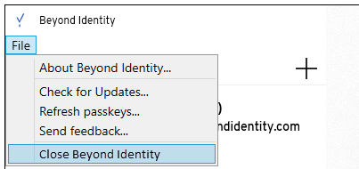
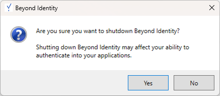

something here
## Cloud

We resolved the issue when switching between policy rules, the policy attributes with multiple fields didn't immediately update the values. Instead, showing the values from the previously selected rule.  

<!--truncate-->

## Authenticators

:::info Operating systems supported

The Beyond Identity Authenticator is supported on the following platforms:

- macOS 10.15 (Catalina) or later

- Windows 10 build 19041 and later or Windows 11
:::

We made the Windows Authenticator application more consistent with the Mac version. Windows users tend to close the application more often than Mac users, which has significantly impacted their authentication performance.

Here are the changes we made:

- Renamed **Exit** under the **File** menu of the Authenticator to **Close Beyond Identity**. Selecting this menu item minimizes the Authenticator application to the Windows Task Tray. Likewise, closing the window from the upper right (X) or selecting Close from the Authenticator's system menu minimizes the Authenticator application to the task tray.

  

- Renamed **Exit Beyond Identity** to **Shutdown Beyond Identity** in the Windows Task Tray context menu. Right-clicking the application icon in the task tray is now the only way to completely shut down the Windows PA.

  

- Changed the message displayed when shutting down the application from the task tray, warning the user that this action may impact authentication.

  

## Desktop Login

## API

