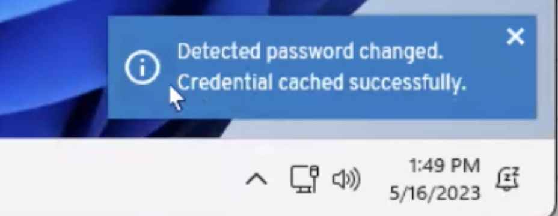

## Cloud

### What's new

#### Policy Attributes

- **JAMF Mobile Device Managed State** .iOS support has been added to the Beyond Identity / JAMF integration. Leverage the <strong>Mobile Device Managed State</strong>&nbsp;to include JAMF managed state of iOS devices in policy rules. For example, rules can be written to only permit iOS devices that are managed to authenticate to your SSO, authenticate to specific applications, or add additional devices.

- **WS-Fed Connection**. Leverage this attribute to match on a specific application configured to federate to Beyond Identity via WS-Fed. For example, write policy rules to allow a specific group of users to authenticate to an ADFS or Azure connection federated to Beyond Identity.

- **Applications Installed &gt; Does Not Contain**. For Windows and macOS devices, match on devices that do not have a specific application installed. For example, match on devices that do not have Zoom installed.

- **Installed Security Software &gt; Does Not Contain**. For Windows and macOS devices, match on devices without specific security software installed. For example, match on devices that do not have Crowdstrike installed.

#### Beyond Identity API access 

Create and manage Beyond Identity API client credentials, tokens, and scopes in the Admin Console <strong>Settings &gt; API Access</strong>. Leverage the Beyond Identity API to access and update Beyond Identity data and objects pragmatically. API scopes include read access to Beyond Identity Users. We plan to add additional scopes over time.

### Improved 

Full-text search on the event grid was improved, making searching for users with
  many events much faster.

### Resolved

- The passkeys detail section was missing the Jailbroken/Rooted status information.

- If the user added text to the search, the selected event filters were resetting to the default values on the events grid.

## Desktop Login

### Improved

Windows Beyond Identity Windows Desktop Login application users will now see a pop-up message from Beyond Identity when they change their Windows Domain user  credentials. The message confirms that their Windows Domain credentials have successfully been cached within the Windows Active Directory Domain.

### Known issues

We are investigating Windows Desktop enrollment failures. For more details, see the<a href="https://support.beyondidentity.com/hc/en-us/articles/14510599143703">Windows Desktop Login Enrollment Failure</a> support article.

## API 

New!

A public documentation website for the Secure Workforce Admin API at https://docs.beyondidentity.com/api. With this API, you can ListUsers via the Admin API. For more details, see the **Cloud** section above on API Access and Token minting.

