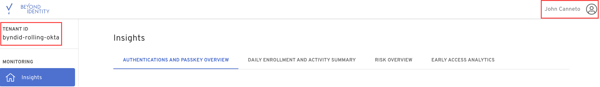
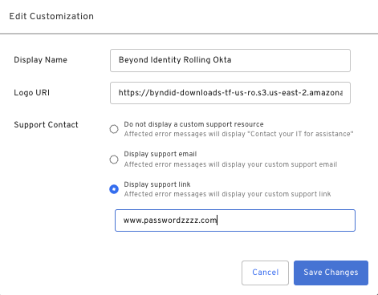
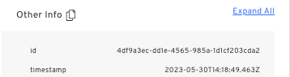

## Cloud

<h3>What's new</h3>

- **Tenant and User Name in Console**: Admin console users can now see their tenant ID and user name when logged into the admin console. Clicking on the user name will reveal their user ID and email.

  

- **Support for Custom URL as Support Contact Info**: We've added the ability to enter a support URL instead of an email. Tenant administrators can add a custom URL in the support customization screen.

  

- **Improvements to Event Details**: Users can now expand the JSON section with one click. The JSON blob expands all paths by clicking the **Expand All** link on the upper right side of the JSON view.

  

- **CSV Export on Passkey Table**: We've added functionality to export the passkey table. The export will respect any filter applied to the table.

