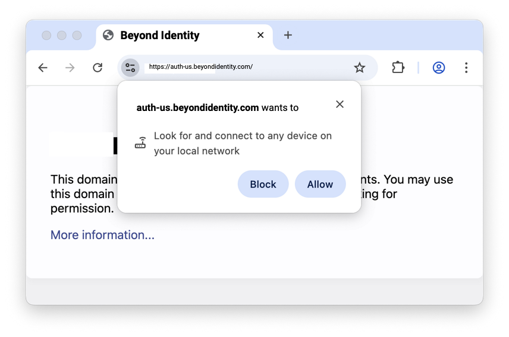

### August 26, 2025

---
### Configure Chrome to Suppress the Local Network Access Prompt for Beyond Identity Secure Access

#### This Article Applies To
- Devices running the **Beyond Identity Authenticator**  
- Users running **Chrome version 141** (or later) on Windows, macOS, and Android (with managed profiles).  
- Users accessing the Beyond Identity **Secure Access console**  

### Overview
Starting with the release of **Chrome version 141 on September 30, 2025**, Chrome and all Chromium-based browsers will introduce a new **Local Network Access (LNA) permission prompt**.  

When signing in to the Beyond Identity Secure Access console, Chrome will prompt you to grant permission for the sign-in page to securely communicate with the Beyond Identity Authenticator on your device.  

This approval is required only once per device to ensure seamless sign-in going forward. Beyond Identity never connects to other devices on your local network; communication is strictly limited to the device where the Authenticator is installed.  

        

Beyond Identity does not attempt to connect to other devices on your local network; communication is limited to the device where the Beyond Identity Authenticator is installed.  

See Google’s announcement: [New permission prompt for Local Network Access](https://developer.chrome.com/blog/local-network-access)  
 

### Why is this happening?
When you sign in to Secure Access via the web, the Beyond Identity sign-in page needs to talk to the Beyond Identity Authenticator app running locally on your device.  

As part of a new security measure, Chrome requires explicit user approval before a website can connect to a local service. The first time you sign in after upgrading to Chrome 141, you may see this one-time permission request.  

### Key Takeaways
- **Privacy-Focused:** This prompt is only for Beyond Identity authentication. Beyond Identity does not connect to or read information from other devices on your network.  
- **One-Time Prompt:** You will only need to accept the prompt once per device. After approval, Chrome remembers your choice.  

### Important admin information
- Admins should promptly notify their Beyond Identity users to accept the local network access prompt that will appear from Chrome.  
- It's important to communicate this change as soon as possible, as denying the prompt will degrade their user experience and could potentially lead to failed authentications.  
- Admins should also provide instructions on how to re-enable local network access if a user has already blocked it.  

### Additional Guidance from Google
Google is introducing new Chrome enterprise policies to give admins greater control over Local Network Access:  

- **Policy controls:** Admins will be able to pre-grant or pre-deny permission for specific sites to make local network requests. This allows managed Chrome environments (such as corporate deployments) to:  
  - Suppress the Local Network Access prompt for trusted, known use cases (e.g., Beyond Identity sign-in pages).  
  - Prevent unapproved sites from requesting the permission at all.  

- **Future expansion:** Google plans to extend Local Network Access enforcement beyond standard HTTP(S) requests. Upcoming Chrome releases will apply the permission model to additional technologies, including WebSockets, WebTransport, and WebRTC connections.  

 
:::info
**Beyond Identity recommends that admins pre-configure managed Chrome profiles to suppress this prompt for their users. Detailed pre-configuration steps will be provided in the coming weeks.**
:::

 
 
 

