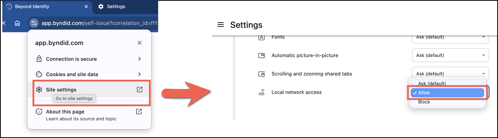
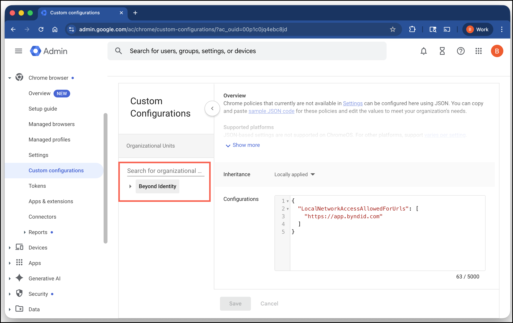

<br/>
November 10, 2025

### This Article Applies To

- Devices running the Beyond Identity Authenticator  
- Users running Chrome version 141 (or later) on Windows, macOS, Android (with managed profiles), and iOS  
- Users accessing the Beyond Identity Secure Work console  

---

### Overview

Starting with the release of Chrome version 141 on **September 30, 2025**, Chrome and all Chromium-based browsers will introduce a new **Local Network Access (LNA)** permission prompt.

When authenticating with Beyond Identity, Chrome will prompt you to grant permission for the sign-in page to securely communicate with the Beyond Identity Authenticator on your device. This approval is required only once per device. To ensure seamless sign-in going forward, make sure to click **Allow** at the prompt.

---

### Chrome Browser Example 1  
**Local Network Access Prompt – app.byndid.com**  

When the prompt appears, click **Allow**.  


---

### Chrome Browser Example 2  
**Local Network Access Prompt**

When the prompt appears, click **Site settings**.  

In the **Local network access** drop-down menu, select **Allow**.  
Your changes are saved automatically.  



---

Beyond Identity does not attempt to connect to other devices on your local network; communication is limited to the device where the Beyond Identity Authenticator is installed.  

See Google’s announcement: *New permission prompt for Local Network Access*  

---

### Why is this happening?

When you sign in to Secure Workforce via the web, the Beyond Identity sign-in page needs to talk to the Beyond Identity Authenticator app running locally on your device.

As part of a new security measure, Chrome requires explicit user approval before a website can connect to a local service. The first time you sign in after upgrading to Chrome 141, you may see this one-time permission request.

---

### Key Takeaways

- **Privacy-Focused:** This prompt is only for Beyond Identity authentication. Beyond Identity does not connect to or read information from other devices on your network.  
- **One-Time Prompt:** You will only need to accept the prompt once per device. After approval, Chrome remembers your choice.  

---

### Important admin information

Admins should promptly notify their Beyond Identity users to accept the local network access prompt that will appear from Chrome. Denying the prompt will degrade the user experience and could potentially lead to failed authentications.

Admins should also provide instructions on how to re-enable local network access if a user has already blocked it.

---

### Additional guidance from Google

Google is introducing new Chrome enterprise policies to give admins greater control over Local Network Access:

- **Policy controls:** Admins will be able to pre-grant or pre-deny permission for specific sites to make local network requests. This allows managed Chrome environments (such as corporate deployments) to:
  - Suppress the Local Network Access prompt for trusted, known use cases (e.g., Beyond Identity sign-in pages).  
  - Prevent unapproved sites from requesting the permission at all.  

- **Future expansion:** Google plans to extend Local Network Access enforcement beyond standard HTTP(S) requests. Upcoming Chrome releases will apply the permission model to additional technologies, including WebSockets, WebTransport, and WebRTC connections.  

Beyond Identity recommends that admins pre-configure managed Chrome profiles to suppress this prompt for their users. Detailed pre-configuration steps will be provided in the coming weeks.  

---

### What you will need to configure

- **Allow list:** `LocalNetworkAccessAllowedForUrls`  
  Add the requesting page origin(s) (`auth-beyondidentity.com` or `*.beyondidentity.com`) so they may call `localhost/127.0.0.1` without a prompt.  

  > Note: You allowlist the origin making the request (e.g., `https://auth-beyondidentity.com`), not the local endpoint.

- **Global switch:** `LocalNetworkAccessRestrictionsEnabled`  
  Ensures LNA is consistently enforced so that allow/block lists take effect.  

---

### Option 1 – Configure Chrome browser using Google Workspace

Blocking the LNA prompt by configuring the Chrome browser allows both MDM-enrolled and BYOD devices a path to a seamless Beyond Identity experience.

### About these URLs
Your organization may use **one** of two Beyond Identity platforms. Add the URLs for the platform you use:
- **Secure Work**: https://app.byndid.com, https://[*.]byndid.com 
- **Secure Access**: https://auth-beyondidentity.com, https://auth-eu.beyondidentity.com

---

### Step-by-step (Google Admin console)

1. In the Workspace admin console, go to **Chrome Browser > Custom Configurations**.  
2. Search for and select **Beyond Identity**.

    

3. In **Configurations**, add the following JSON configuration. Replace the sample URLs with your own Beyond Identity tenant URLs, depending on the platform you use:

    ```json
    {
      "LocalNetworkAccessAllowedForUrls": [
        "https://auth-beyondidentity.com",
        "https://auth-eu.beyondidentity.com"
      ]
    }
    ```

4. Click **Save**.  
5. Open `chrome://policy` and click **Reload policies** to confirm values are applied.  

Learn more about configuring custom Chrome policies in Workspace – *link*  

---

### Option 2 – Configure Chrome browser using MDM

You can use your Mobile Device Management (MDM) solution to deploy a policy that pre-grants LNA permission for your Beyond Identity URLs on managed devices.  

This prevents users from seeing the prompt. The configuration varies slightly by operating system.

---

### Windows (via Intune)

In the Intune console, create a **custom device configuration profile**:

- Navigate to: **Devices > Configuration > Create profile**  
- Platform: Windows 10 and later  
- Profile type: Template  
- Template name: Custom  

**Add OMA-URI rows:**

1. Enter the LNA URI in the **OMA-URI** property:  

    ```
    ./Device/Vendor/MSFT/Registry/HKLM/SOFTWARE/Policies/Google/Chrome/LocalNetworkAccessAllowedForUrls
    ```

2. Enter the URLs you want to allow-list in the **Value** property. Use one or both platform sets as needed:

    https://auth-beyondidentity.com   OR
    https://auth-eu.beyondidentity.com


- If you are entering more than one URL, create a unique row for each URL, and number the OMA-URI accordingly.  

    ```
    ./Device/Vendor/MSFT…LocalNetworkAccessAllowedForUrls/
    ```

3. Assign the profile to the desired groups and proceed to test.

---

### macOS

For macOS devices managed by an MDM, deploy a configuration profile (`.mobileconfig`) with a custom payload for Chrome in the `com.google.Chrome` preference domain.

Example `.plist` snippet:

    ```xml
    <key>LocalNetworkAccessAllowedForUrls</key>
    <array>
        <string>https://auth-beyondidentity.com</string>
        <string>https://auth-eu.beyondidentity.com</string>
    </array>
    <key>LocalNetworkAccessRestrictionsEnabled</key>
    <true/>
    ```

---

### Android (via Managed App Configuration)

For managed Android devices, push the policy using your MDM's managed app configuration for the Google Chrome app.  
In your MDM console, navigate to the app configuration settings for Google Chrome and add the following JSON configuration.

    ```json
    {
      "LocalNetworkAccessAllowedForUrls": [
        "https://auth-beyondidentity.com",
        "https://auth-eu.beyondidentity.com"
      ],
      "LocalNetworkAccessRestrictionsEnabled": true
    }
    ```

See this link to learn more about the Local Network Access setting – [Chrome Enterprise Policy Reference](https://chromeenterprise.google/policies/#LocalNetworkAccessAllowedForUrls)


### Testing

1. Open a browser where the settings have been assigned.  
2. Enter `chrome://policy` in the search bar and verify the policy has been applied to the browser.  
   - Look for the `LocalNetworkAccessAllowedForUrls` policy and verify that your Beyond Identity URLs are listed.  
3. Enter `chrome://flags` in the search bar.  
   - Find the **Local Network Access Checks** setting and configure it to **Enabled** (it will not be enabled by default until the launch of Chrome M141).  
4. Sign in with Beyond Identity.  

---

### Frequently Asked Questions

**Q: How many times will I see this prompt?**  
A: You will only need to click **Allow** once per device. After you grant permission, you will not see the prompt again on that device.  

**Q: What if I'm on a mobile device?**  
A: This prompt will also appear on mobile devices. If your organization manages your device, the setting can be pre-approved for Android devices. If not, users will need to accept the prompt the first time you use Beyond Identity.  

**Q: What if a user accidentally clicks "Block"?**  
A: If a user accidentally blocks the permission, it can be reset directly in Chrome's site settings for the `app.byndid.com` domain.  

1. While on your Beyond Identity sign-in page, click the padlock icon (or tune icon) on the left side of the address bar to open the site settings menu.  
2. Find the setting for **Local network access**.  
3. Use the toggle to change the permission from **Block** back to **Allow**.  
4. Reload the page. Beyond Identity authentication should now work correctly.  
