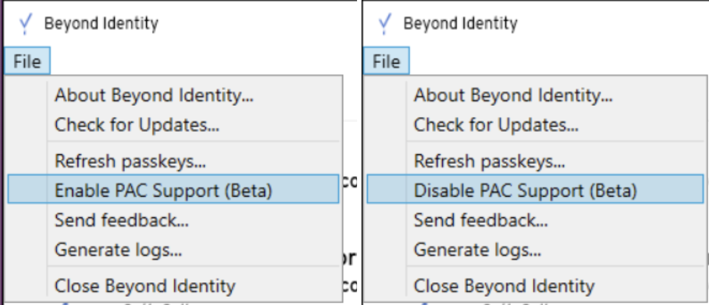

## Proxy support overview

[As of this update](/docs/release-notes/release-notes-changelog#january-31st-2025), Beyond Identity is in the process of adding official proxy support to the Platform Authenticator on the macOS and Windows platforms. This is the first release to preview this functionality.   

To minimize the chance of any change in behavior for existing users of Beyond Identity, this feature is not active by default. However, during the preview phase of this feature, the end user of the Platform Authenticator can enable this functionality.  The list below details what happens when this feature is enabled.

- If you have no proxy settings and you enable this feature, then no change occurs in functionality.  This feature has no impact, enabled or disabled, if you do not use a proxy in your environment.
- If your Windows or macOS settings indicate a manual HTTPS proxy or PAC file URL, those settings are used by the Platform Authenticator as it makes all HTTPS requests out.

In a future release, this feature defaults to an enabled state.  We recommend any current users of Beyond Identity to turn on the feature with an administrator and to attempt an authentication as normal. With this feature enabled and authentication working as expected, no future change is required on your configuration.

We are releasing this feature on Windows, then macOS shortly to follow.  This specific release only updates Windows.

## End user guide

This section covers the actions IT administrators take to toggle visibility of this functionality for your organization's end users.

1. To turn on the proxy PAC support, go to **File** > **Enable PAC Support (Beta)**.  When the feature is enabled, the **File** > **Disable PAC Support (Beta)** appears in the menu.



## Administrative requirements

Bypass any requests for host `*.authenticator.beyondidentity.com`. These domains resolve to `localhost` or `127.0.0.1` and are used for communication by the Platform Authenticator local to the system.

Without this bypass added, the Windows Platform Authenticator works as expected, but the macOS Authenticator performance suffers. All platforms, however, require this bypass, including Windows.

:::note
**Limitations** - Only HTTP proxies are supported.
:::

### Example PAC file

This code sample defines network routing rules for proxy server configuration. It configures authentication services to work as expected and maintain security through proxy routing for general internet traffic.

```javascript
function FindProxyForURL(url, host)
{
    // Exclude FTP from proxy
    if (url.substring(0, 4) == "ftp:")
    {
        return "DIRECT";
    }
     
    // Bypass proxy for internal hosts
    if (isInNet(host, "0.0.0.0", "255.0.0.0")||
        isInNet(host, "10.0.0.0", "255.0.0.0") ||
        isInNet(host, "127.0.0.0", "255.0.0.0") ||
        isInNet(host, "169.254.0.0", "255.255.0.0") ||
        isInNet(host, "172.16.0.0", "255.240.0.0") ||
        isInNet(host, "192.0.2.0", "255.255.255.0")||
        isInNet(host, "64.206.157.136", "255.255.255.255"))
     {
        return "DIRECT";
     }

     // Bypass proxy for DNS entries required by iOS/macOS Authenticators
     if (host == "pa.authenticator.beyondidentity.com" ||
         host == "pa2.authenticator.beyondidentity.com")
     {
        return "DIRECT";
     }

     return "PROXY 192.168.7.44:8080";
}
```

## Administrative feature control

As an administrator using MDM or other automation, you can also enable this feature or disable this feature.  When the administrator takes this action, the end user no longer has any control over the feature.  The **File menu** option **Enable / Disable PAC Support (Beta)** shown above also disappears.

### Commands for administrators

The following sections include commands to execute for enabling or disabling the proxy support visibility.

#### Enable PAC file detection

- macOS - Must execute as root using `sudo` or with MDM script. *NOTE*: `sudo` not required.

```
sudo /Applications/Beyond\ Identity.app/Contents/Resources/BIConfigure --enable-auto-proxy
```

- Windows - Must execute using MDM or from a Windows command prompt with administrator privileges.

```
C:\Program Files\BeyondIdentity\Tools\BIConfigure --enable-auto-proxy
```

#### Disable PAC file detection

- macOS - Must execute as root using `sudo` or with MDM script. *NOTE*: `sudo` not required.

```
sudo /Applications/Beyond\ Identity.app/Contents/Resources/BIConfigure --disable-auto-proxy
```

- Windows - Must execute using MDM or from a Windows command prompt with administrator privileges.

```
C:\Program Files\BeyondIdentity\Tools\BIConfigure --disable-auto-proxy
```

#### Clear administrative control

- macOS - Must execute as root using `sudo` or with MDM script. *NOTE*: `sudo` not required.

```
sudo /Applications/Beyond\ Identity.app/Contents/Resources/BIConfigure --remove-auto-proxy
```

- Windows - Must execute using MDM or from a Windows command prompt with administrator privileges.

```
C:\Program Files\BeyondIdentity\Tools\BIConfigure --remove-auto-proxy
```

#### Show proxy status

- macOS - This command does not require root privileges.

```
/Applications/Beyond\ Identity.app/Contents/Resources/BIConfigure --show-auto-proxy
```

- Windows - Execute using a Windows command prompt. This does not require administrator privileges.

```
C:\Program Files\BeyondIdentity\Tools\BIConfigure --show-auto-proxy
```