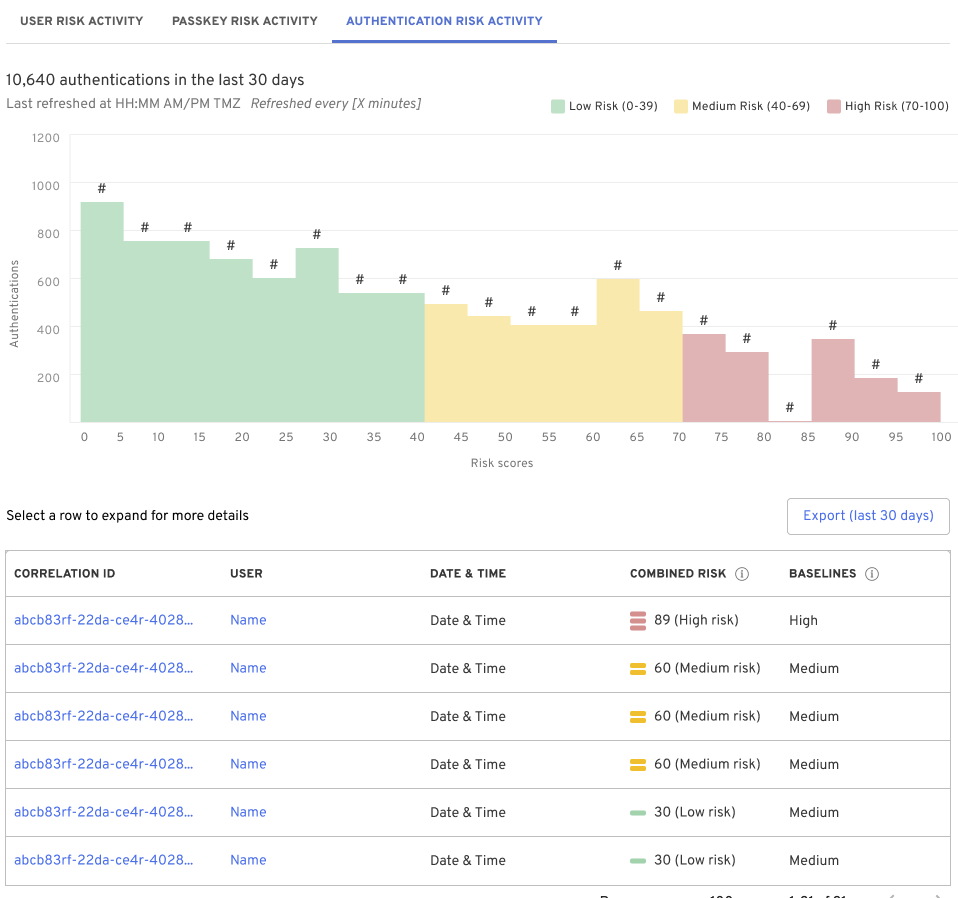
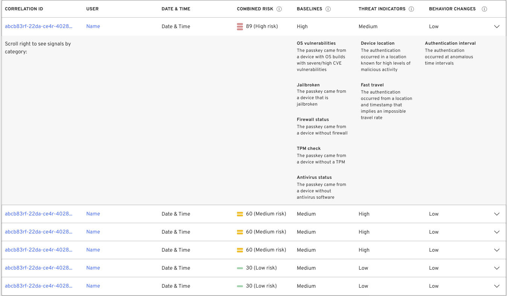
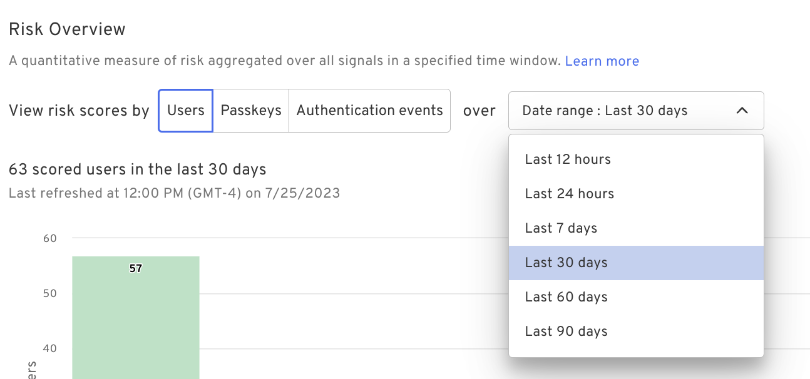
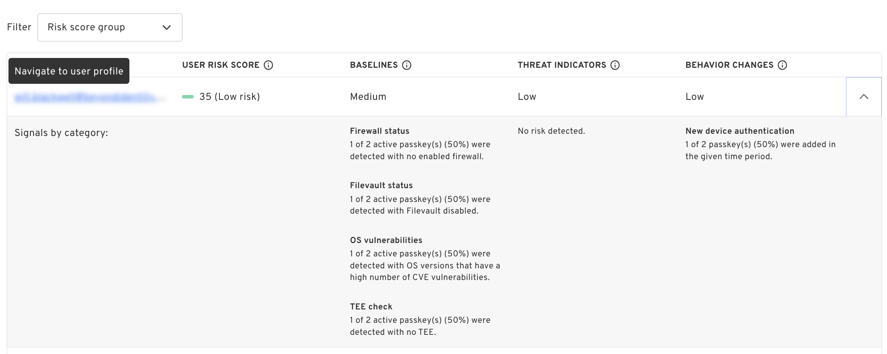

  The <b>Threat Dashboard</b> is an early access feature and requires an entitlement. Reach out to our team for access!

 

The dashboard provides easy-to-use and intuitive threat intelligence analytics. This new dashboard will help you identify users, passkeys, and authentications that have displayed some risk over the last 0-90 days. 

It includes interactive filters, weighting controls, and widgets displaying IDs, devices, and authentications associated with risk. Risky entities are added to low, medium, and high groups based on their score from 0-100. You can drill down into details and export or share the dashboard. 

- Additional information about each entity's risk can be viewed by clicking on the associated row in the table below the bar chart.

- If a user or passkey is of higher risk, you can navigate to the user's profile or the passkey and revoke them.

- The risk overview also helps build policy based on the vulnerabilities observed across your fleet.

## Distribution of scored entities

This view displays the distribution of scored entities (users, passkeys, or authentications) across the fleet. We score each entity at the time of authentication, and you can adjust the authentication window to see how each entity is scored over time. 

The table below the bar chart represents the list of users, passkeys, or authentications summarized in the bar chart above. Clicking on any row will expand the view, providing more information about the vulnerabilities observed for each.

## Filtering

You can choose which view you want; choose between user, passkey, and authentication risk distributions. On the right, you can select the date range of authentication activity.

This view shows the interactive filtering options available. 

## How it works

Beyond Identity uses several risk signals to quantify security risks and identify suspicious behaviors. Each signal is designed to assign a score to individual authentication events. Risk reports aggregate these scores across tenants, providing an initial overview of the security risks present.

However, the challenge lies in the fact that most risk signals score authentications or devices, and their output values lack consistent meaning, except that higher values indicate higher risk. Beyond Identity has implemented a risk aggregation approach to address this issue and provide more interpretable scores at various levels (authentication, device, identity, and tenant).

In this risk aggregation process, outputs from individual risk signals are aggregated into Z-scores, representing deviations from models representing normal risk behavior. Positive Z-scores indicate higher-than-average risk, while negative Z-scores indicate higher-than-average trustworthiness. The models used for aggregation are either manually specified or inferred by analyzing the collective data from all customers.

Beyond Identity utilizes Stouffer's method to combine Z-scores from different signals effectively. This approach allows us to comprehensively assess the overall risk posture at the authentication, device, identity, and tenant levels.

As an example, consider the "Firewall Status" risk signal. It outputs a value of 1 if no firewall is detected on a device and 0 if a firewall is present. Let's say a tenant has 100 devices, and 60 lack a firewall, resulting in a SUM of signal outputs equal to 60. The model used for this signal assumes that firewalls should protect 50% of devices.

By applying the risk aggregation methodology, Beyond Identity can generate meaningful and interpretable risk scores that provide insights into security risks at different levels. This enables us to better understand and address potential security threats and enhance the overall security posture for our customers.

### Risk categories

|CATEGORY|DESCRIPTION|
| --- | --- |
|Baselines|This category includes risk signals that detect deviations from standard security practices, like enabling a firewall and keeping the OS up-to-date.|
|Threat indicators|This category includes risk signals that detect indicators of compromise that could occur if an identity or device are stolen.|
|Behavior changes|This category includes risk signals that detect anomalous behaviors. These are not smoking guns for malicious activity, but they could provide further evidence for an active threat.|

### Baseline signals

|SIGNAL NAME|DESCRIPTION|DETECTIONS  In the selected time window…|
| --- | --- | --- |
|Antivirus status|This signal detects whether an authenticating device has antivirus software disabled.|X of Y active devices were detected with no enabled antivirus software.|
|FileVault status|This signal detects whether an authenticating device has disabled Filevault disk encryption. This is only relevant for devices running MacOS.|X of Y active devices were detected with Filevault disabled.|
|Firewall status|This signal detects whether an authenticating device has a disabled firewall.|X of Y active devices were detected with no enabled firewall.|
|Jailbroken status|This signal detects whether an authenticating device is either jailbroken or rooted.|X of Y active devices were detected as either jailbroken or rooted.|
|OS support|This signal detects whether an authenticating device uses an OS build that is no longer supported by security updates.|X of Y active devices were detected with OS versions no longer supported by their vendors.|
|OS vulnerabilities|This signal detects whether an authenticating device uses an OS version with an anomalously high number of CVEs that have high or critical severities. Detections are made for measurements that are two or more standard deviations above the mean.|X of Y active devices were detected with OS versions that have a high number of CVE vulnerabilities.|
|Password set|This signal detects whether an authenticating device is not password protected|X of Y active devices were detected with no password protection.|
|TEE check|This signal detects whether an authenticating device has no TEE or secure enclave for storing credentials.|X of Y active devices were detected with no TEE or secure enclave.|

### Threat indicator signals

|SIGNAL NAME|DESCRIPTION|DETECTIONS  In the selected time window…|
| --- | --- | --- |
|Device location|This signal detects whether an authentication occurs from a country known for high levels of malicious activity.|X of Y authentications were detected as originating from a country associated with high levels of malicious activity.|
|Fast travel|This signal detects whether consecutive authentications from a single user imply an impossible rate of travel, greater than 500 mph.|X of Y authentications were found to imply an impossible travel rate.|
|IP blocklists|This signal detects whether an authenticating IP has one or more matches on a set of public IP blocklists.|X of Y authentications had IPs that were matched to an IP blocklist.|
|TOR exit|This signal detects whether an authenticating IP is a Tor exit node used to hide the true actor IP.|X of Y authentications had IPs that were matched to a Tor exit node.|
