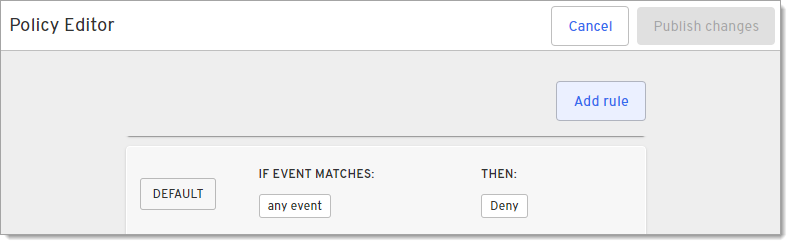
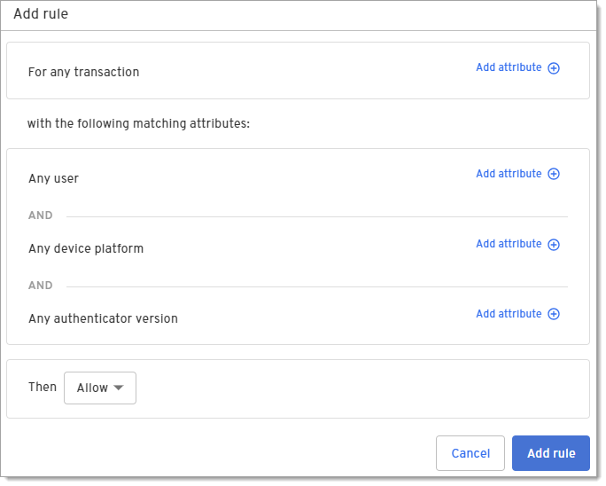
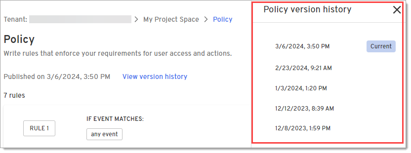
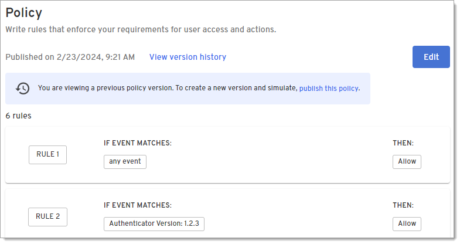
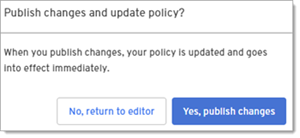

# Policy & Simulation
Use policy simulation to validate and test policies that will allow or restrict access to devices and apps before pushing them out to your fleet.
This helps to ensure that deployments are successfully rolled out the first time without disruptions to users.

## Create a policy

1. Click **Policy & Simulation** under Tools.

2. Click **Add rules to your policy** to open the Policy Editor page.

  

3. Click **Add rule**.

   

4. On the Add rule dialog, select **Authentication** as the transaction type under **For any transaction**.

  

5. Click **Add attribute** and select one or more attributes for this rule.

   | Attribute                      | Description |
   | ------------------------------ | ----------------------------------------------------------------------------------------------------------------------------------------------------------------------------------------------------------------------------------------------------------------------------------------------------------------------------------------------------------------------------------------------------------------------------------------------------------------------------------------------------------------------------------------------------------------------------------------------------------------------------------------- |
   | **Any user**                   | Enter the number or registered devices that will trigger this rule. |
   | **Any device platform**        | Select the operating system platform that will trigger this rule.       |
   | **Any authenticator version**  | Enter the version of the Beyond Identity Authenticator installed on the device that will trigger this rule.  |

6. Click whether to Allow or Deny this transaction based on the attributes in this rule.
   - **Allow -** Stops processing the rules if the criteria is met and will allow the transaction to complete.

   - **Allow W/ OS Verification -** Stops processing the rules if the criteria is met and will allow the  transaction to complete once the user verifies their identity using their operating system. 

   - **Deny -** Stop processing the rules. and will deny the transaction.

7. Click **Add rule** at the bottom of this dialog to add this rule to the policy.
   

8. Repeat steps 3-7 to add more rules to this policy.

9. When finished adding rules, click **Publish changes** on the Policy Editor page.
   

10. When prompted, confirm that you want to publish changes.

11. When you are returned to the Policy page, click **Simulate** to see how the rules would impact devices in your organization.

## View version history
From the Policy page, you can view or revert to previous policy versions.
This is helpful if you test a new policy and realize it will block a number of users
so you want to revert to the last valid version of the policy.

1. On the Policy page, click **View version history**.
   

2. On the panel that pops out to the right, select a previous version of a policy.
   

3. Review the previous policy.

   

3. To revert to this policy, click the **publish this policy** link in the blue banner message that displays at the top of the page.

4. On the Policy Editor (restore version) page, click **Restore Version**.
   

5. When prompted, confirm that you want to publish the previous version.
   
