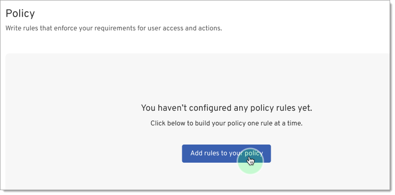
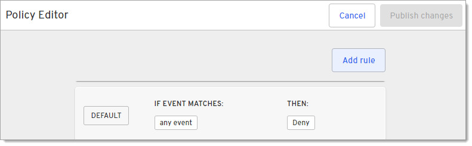
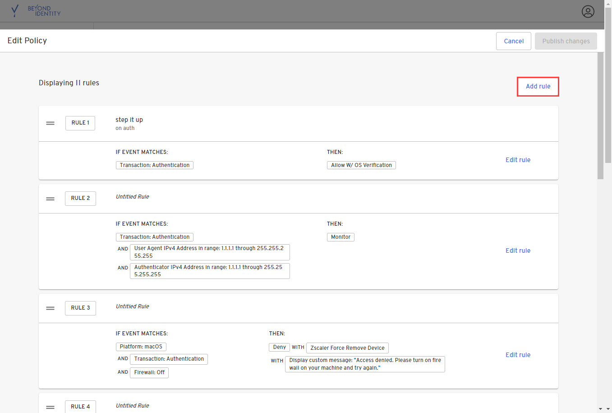
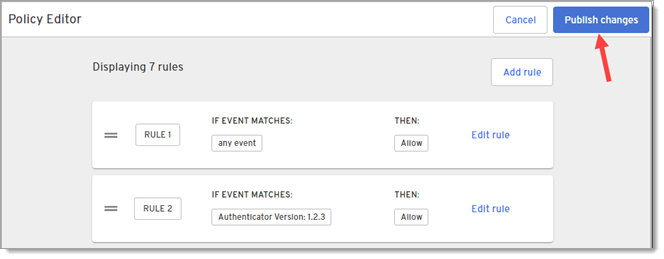
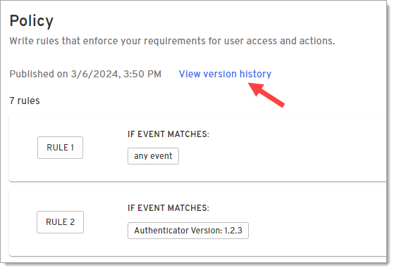
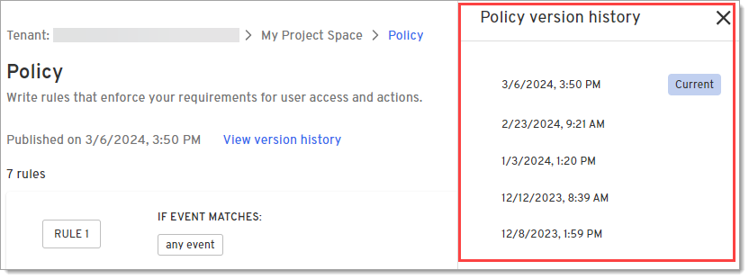
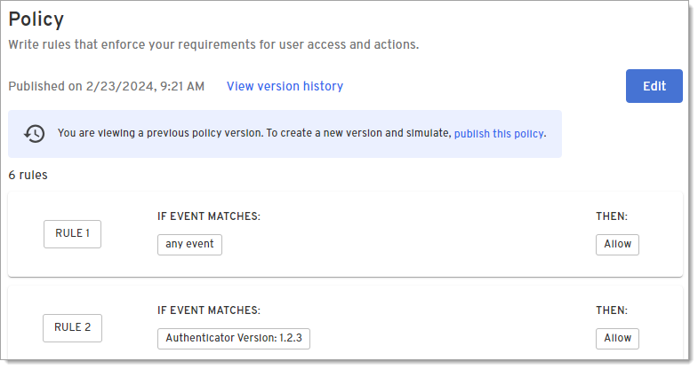

## Create a policy

1. Click **Policy** under Tools.

2. Click **Add rules to your policy** to open the Policy Editor page.

   

3. Click **Add rule**.

   

4. On the Add rule dialog, select **Authentication** as the transaction type under **For any transaction**.

   

5. Click **Add attribute** and select one or more attributes for this rule.

   | Type                        | Platform | Name                     | Description                            | Source             |
   | --------------------------- | -------- | ------------------------ | -------------------------------------- | ------------------ |
   | **Any user**                | N/A      | has registered device(s) | Checks how many devices a user has registered. For example if a user in the Accounting group has more than 5 registered devices, it could indicate a risk. | Beyond Identity Cloud |
   | **Any user**                | N/A      | is in user group         | Checks whether a user is a member of a user group. | Beyond Identity Cloud   |
   | **Any device platform**     | N/A      | N/A                      | Checks whether the OS on a device is supported by your organization.      | Beyond Identity Authenticator |
   | **Any device platform**     | Android  | Device Root is           | Checks whether a device has been rooted so you can deny authentication.    | Queries files and packages that would indicate a root. |
   | **Any device platform**     | Android  | Device has authentication     | Checks whether device authentication is required. If not, you may want to deny authentication because the device can connect to unsecure internet connections. | Android KeyguardManager API |
   | **Any device platform**     | Android  | Authentication method enabled | Checks the type of authentication on the device such as <ul><li>Biometric</li> <li> PIN or Password</li></ul>   | Android KeyguardManager API |
   | **Any device platform**     | Android  | API Level                | Checks the version of the framework API.     | The SDK version of the software currently running on the device. |
   | **Any device platform**     | ChromeOS with Android PA | N/A      | Checks whether the device is a Chromebook using ChromeOS and the Android authenticator.      |  |
   | **Any device platform**     | iOS      | Device jailbreak is      | Checks whether a device has been jailbroken so you can deny authentication. | Checks for a jailbreak.txt file and whether the device can access cydia or the shell. |
   | **Any device platform**     | iOS      | Device has authentication | Checks whether device authentication is required. If not, you may want to deny authentication because the device can connect to unsecure internet connections. | Apple canEvaluatePolicy API |
   | **Any device platform**     | iOS      | Authentication method enabled | Checks the type of authentication on the device such as <ul> <li> Biometric</li> <li> PIN</li> <li> PIN and Password</li></ul> | Apple canEvaluatePolicy API |
   | **Any device platform**     | iOS      | Version                  | Checks the major and minor version of the device.      | Apple operatingSystemVersionString API |
   | **Any device platform**     | Linux    | Installed Security Software is | Checks whether security software, such as CrowdStrike is installed on the device.   |  |
   | **Any device platform**     | Linux    | Process running contains | Checks whether the name of a process is running on the device. | osquery |
   | **Any device platform**     | Linux    | Process running does not contain | Checks to make sure a process is not running on the device. | osquery |
   | **Any device platform**     | Linux    | System disks encrypted is | Checks whether the disk is encrypted. | Beyond Identity Authenticator |
   | **Any device platform**     | Linux    | File exists              | Checks whether a file you specify exists on the device. | osquery |
   | **Any device platform**     | Linux    | OS version               | Checks the OS version on the device. | osquery |
   | **Any device platform**     | Linux    | TPM version              | Checks whether the authenticating device does not have TEE (Trusted Execution Environment OR TPM/Secure Enclave). | osquery |
   | **Any device platform**     | macOS    | Antivirus is             | Checks whether the authenticating device has antivirus disabled. | Queries XProtect plist file |
   | **Any device platform**     | macOS    | Firewall is              | Checks whether the authenticating device has a disabled firewall. | Queries firewall plist file |
   | **Any device platform**     | macOS    | Installed Security Software is | Checks whether security software, such as CrowdStrike is installed on the device. | Queries files for specific apps |
   | **Any device platform**     | macOS    | App installed contains   | Checks whether an app you specify has a specific version installed. This is useful for locating unsupported versions of apps in your environment. | osquery |
   | **Any device platform**     | macOS    | File exists              | Checks whether a file you specify exists on the device. | osquery |
   | **Any device platform**     | macOS    | Plist key value contains | Checks whether the preference file contains a specific value for the: <ul> <li> Path</li> <li> Key</li> <li> Subkey </li> <li> Number or String</li> <li> Value</li></ul> | osquery |
   | **Any device platform**     | macOS    | Process running contrains | Checks whether the name of a process is running on the device. | osquery |
   | **Any device platform**     | macOS    | Process running does not contain | Checks to make sure a process is not running on the device. | osquery |
   | **Any device platform**     | macOS    | User FileVault is        | Checks whether the authenticating device has FileVault disabled. | Queries FDE status |
   | **Any device platform**     | macOS    | OS version               | Checks the OS version on the device. | Apple operatingSystemVersionString API |
   | **Any device platform**     | Web Authenticator |                 | Checks whether the connecting device is using a browser to authenticate. |  |
   | **Any device platform**     | Windows  | Antivirus is             | Checks whether the authenticating device has antivirus disabled. | Microsoft Windows Security Center API |
   | **Any device platform**     | Windows  | Firewall is              | Checks whether the authenticating device has a disabled firewall. | Microsoft Windows Security Center API |
   | **Any device platform**     | Windows  | Installed Security Software is | Checks whether security software, such as CrowdStrike is installed on the device. | Microsoft Windows Security Center API |
   | **Any device platform**     | Windows  | Domain Name contains     | Checks whether the device is on an approved Windows domain. |  |
   | **Any device platform**     | Windows  | File exists              | Checks whether a file you specify exists on the device. | osquery |
   | **Any device platform**     | Windows  | Application installed contains | Checks whether an app you specify has a specific version installed. This is useful for locating unsupported versions of apps in your environment. | osquery |
   | **Any device platform**     | Windows  | Processing running contains | Checks whether the name of a process is running on the device. | osquery |
   | **Any device platform**     | Windows  | Process running does not contain | Checks to make sure a process is not running on the device. | osquery |
   | **Any device platform**     | Windows  | Registry Key exists      | Checks whether the name of a registry key exists.  | osquery |
   | **Any device platform**     | Windows  | Registry Key value       | Checks whether a specific value for a registry key exists. | osquery |
   | **Any device platform**     | Windows  | Service installed contains | Checks if Windows services are installed.| osquery |
   | **Any device platform**     | Windows  | Service running contains | Checks whether a specific Windows service is running. | osquery |
   | **Any device platform**     | Windows  | System Disks Bitlocker is | Checks whether BitLocker has been enabled on the device. | Microsoft BitLocker API |
   | **Any device platform**     | Windows  | Version                  | Checks the OS version on the device. | Microsoft Environment AP |
   | **Any integration**         | CrowdStrike Falcon | Zero Trust Assessment Score | Checks the device's zero trust score. | Crowdstrike Host API |
   | **Any integration**         | CrowdStrike Falcon | Device found   | Checks whether CrowdStrike is able to collect data on the device. | Crowdstrike Host API |
   | **Any integration**         | CrowdStrike Falcon | Connection is  | Checks whether the device is connected to CrowdStrike. | Crowdstrike Host API |
   | **Any integration**         | Cybereason | Sensor found           | Checks whether the Cybereason Silent Sensor is available on the device. | Cybereason API |
   | **Any integration**         | Cybereason | Prevention status      | Checks whether Cybereason prevention is enabled or not installed. | Cybereason API |
   | **Any integration**         | Intune   | Connection is            | Checks whether the device is connected to Intune. | Microsoft Graph API |
   | **Any integration**         | Intune   | Registration             | Checks the device's registration status for Intune. | Microsoft Graph API |
   | **Any integration**         | JAMF     | Connection is            | Checks whether the device is connected to JAMF. | Jamf Pro API |
   | **Any integration**         | JAMF     | Managed state is         | Checks whether the device is managed by JAMF. | Jamf Pro API |
   | **Any integration**         | JAMF     | Mobile Device Managed State is | Checks whether the mobile device is managed by JAMF. | Jamf Pro API |
   | **Any integration**         | Kandji   | API is                   | Checks whether the Kandji API is available on the device. | Kandji API |
   | **Any integration**         | Kandji   | Device is managed        | Checks whether the device is managed by Kandji. | Kandji API |
   | **Any integration**         | SentinelOne | Agent is active       | Checks whether the SentinelOne agent is in use. | SentinelOne API |
   | **Any integration**         | SentinelOne | Agent is decommissioned | Checks whether the agent is in a  decomissioned state while the device is under maintenance, the user is on vacation, etc. | SentinelOne API |
   | **Any integration**         | SentinelOne | Agent operational state | Checks the status of the SentinelOne agent on the device. | SentinelOne API |
   | **Any integration**         | SentinelOne | Connection is         | Checks whether the device is connected to SentinelOne. | SentinelOne API |
   | **Any integration**         | SentinelOne | Device found          | Checks whether SentinelOne is able to collect data on the device. | SentinelOne API |
   | **Any integration**         | Workspace one | UEM                 | Checks whether the device is connected to Workspace ONE. | VMWare AirWatch API |
   | **Any integration**         | Workspace one | UEM                 | Checks whether the device is enrolled in Unified Endpoint Management (UEM). | VMWare AirWatch API |
   | **Any authenticator version** | N/A    | Authenticator version    | Checks the version of the Beyond Identity Authenticator installed on the device. | Beyond Identity Authenticator |

6. Click whether to Allow or Deny this transaction based on the attributes in this rule.
   - **Allow -** Stops processing the rules if the criteria is met and will allow the transaction to complete.

   - **Allow W/ OS Verification -** Stops processing the rules if the criteria is met and will allow the  transaction to complete once the user verifies their identity using their operating system. 

   - **Deny -** Stop processing the rules. and will deny the transaction.

7. Click **Add rule** at the bottom of this dialog to add this rule to the policy.

   

8. Repeat steps 3-7 to add more rules to this policy.

9. When finished adding rules, click **Publish changes** on the Policy Editor page.

   

10. When prompted, confirm that you want to publish changes.

11. If you have Device360, when you are returned to the Policy page, click **Simulate** to see how the rules would impact devices in your organization.

    Use policy simulation to validate and test policies that will allow or restrict access to devices and apps before pushing them out to your fleet. This helps to ensure that deployments are successfully rolled out the first time without disruptions to users.

## View version history
From the Policy page, you can view or revert to previous policy versions.
This is helpful if you test a new policy and realize it will block a number of users
so you want to revert to the last valid version of the policy.

1. On the Policy page, click **View version history**.

   

2. On the panel that pops out to the right, select a previous version of a policy.

   

3. Review the previous policy.

   

4. To revert to this policy, click the **publish this policy** link in the blue banner message that displays at the top of the page.

5. On the Policy Editor (restore version) page, click **Restore Version**.

   

6. When prompted, confirm that you want to publish the previous version.

   
