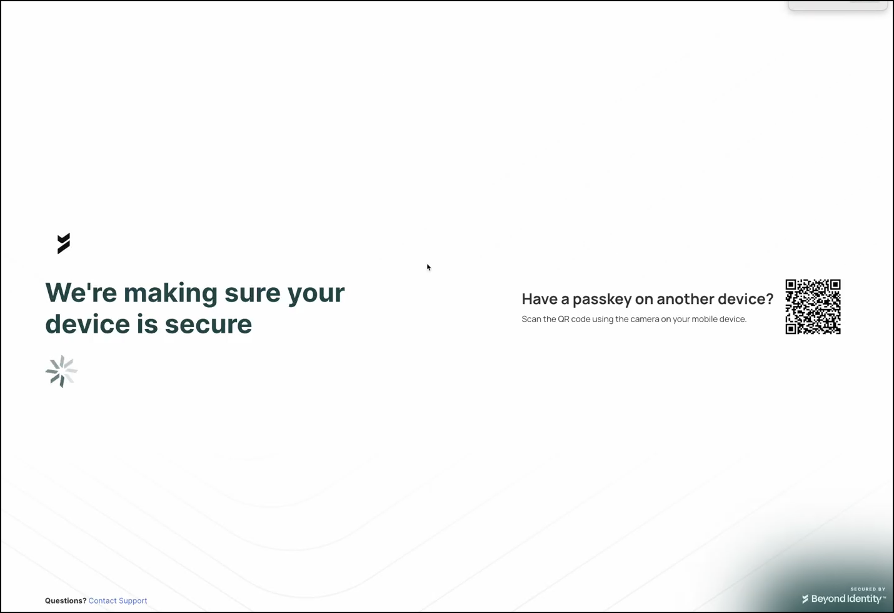
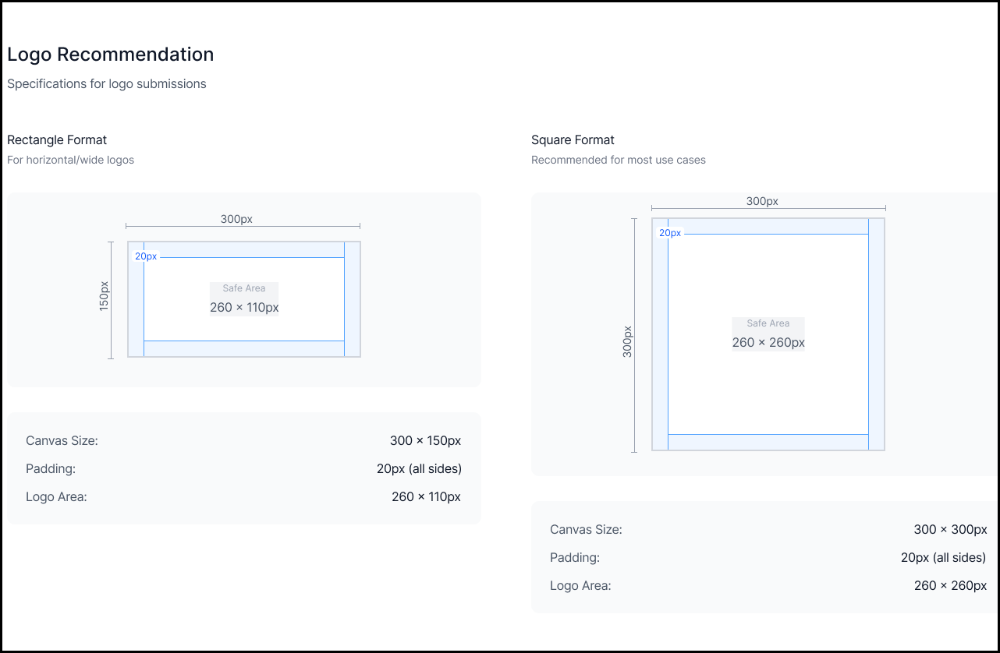

# Tenant Logo Requirements

## Overview

Customer tenants can upload their company logo for use across key Beyond Identity user experiences. This helps ensure consistent branding and clear visual recognition during authentication.

---

## Where the Logo Appears

Your company tenant logo is displayed in the following locations:

- **Passkey Icon** – Used in existing authentication flows.
- **Authentication Loading Screens** – (Limited availability).

> **Note:** Logo customization for authentication loading screens is available to tenants using the platform’s authentication flow. To enable this feature, submit a request through Beyond Identity Support.

---

    

 

## Logo Specifications

| Requirement | Description |
|------------|-------------|
| **Dimensions** | 300 × 300 px (square) 300 × 150 px (rectangle) |
| **Background** | White background is recommended for best contrast in both light and dark mode. |
| **Transparency** | Transparent backgrounds are acceptable if logo colors remain clearly visible in both light and dark mode. |
| **Padding** | 20 px padding recommended on all sides. |
| **Tenant Name** | Including the tenant name within the logo is recommended for clarity and identification. |

    
