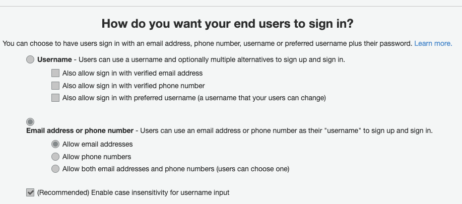
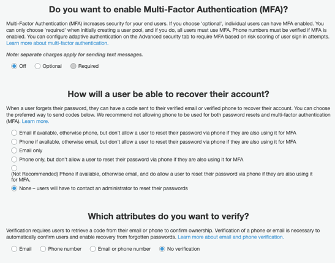
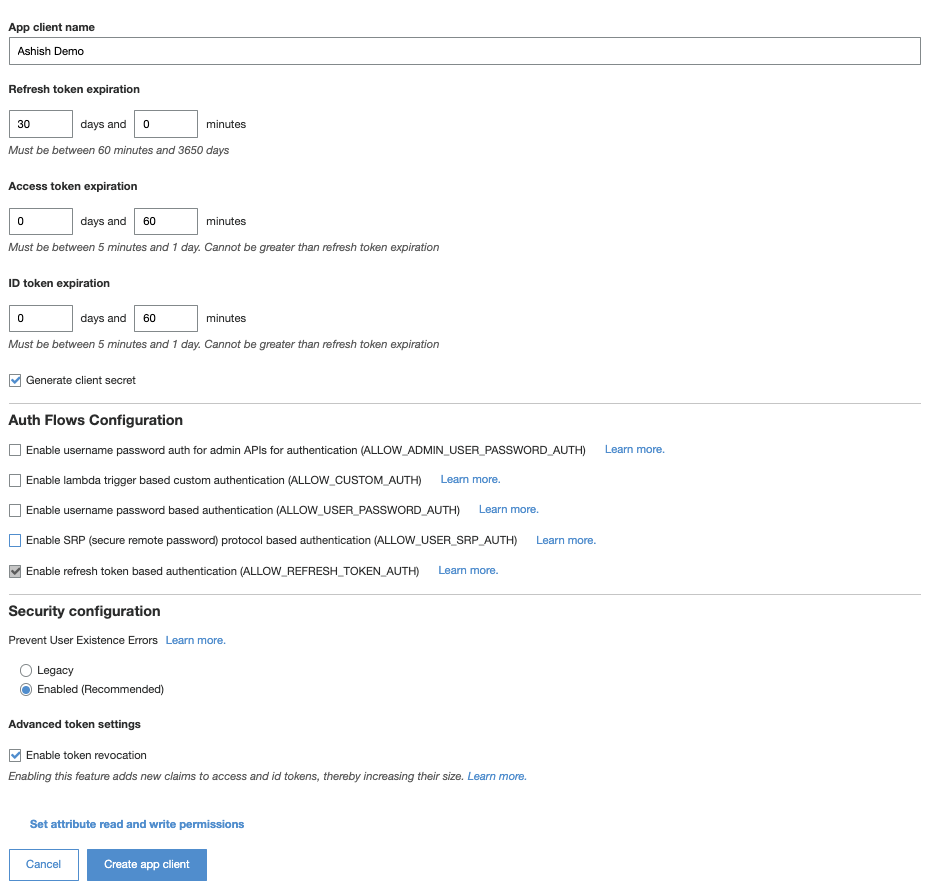
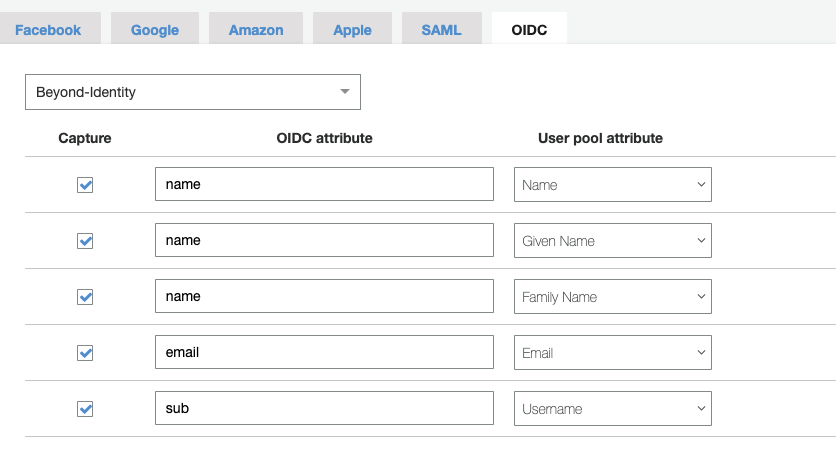
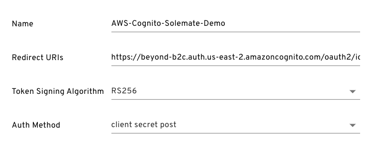
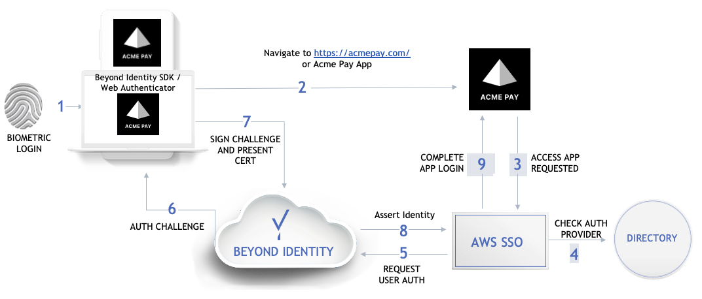

This guide provides information on how to set up Beyond Identity as a Passwordless login provider for applications that use AWS Cognito to manage their identities.
## Prerequisites
Administrator user privileges to AWS console.
### User Pool setup

#### heading 4

*Why are we not just giving them the [link](https://docs.aws.amazon.com/cognito/latest/developerguide/tutorial-create-user-pool.html) to the vendor documentation, which is always up to date, so we can focus on integrating Beyond Identity with AWS.*

1. Go to the [Amazon Cognito console](https://console.aws.amazon.com/cognito/home), select **User Pools > Create a user pool**.

2. Configure the sign-in experience for your users, for example, username or email address address. Then select

  

3. Select **email**, **family name**, **given name**, and **name** for the required standard attributes. 

  

4. Skip adding custom attributes and leave the default values for policies.

5. Configure the multi-factor authentication (MFA) requirements and user account recovery options.

  

6. Leave the default settings for Message customizations, tags, and devices.

7. Integrate your app, name your user pool, configure the hosted UI, and create an app client. Then click **Create app client**. 

  

8. Leave the default values in Triggers and then click **Create Pool**.

## Configure Beyond Identity as the IdP

1. Navigate to FederationIdentity Providers.

3. Click on OpenID connect and configure a new Provider as below.

4. Client ID and Secret will be generated from BI Admin console (Refer to the section)

  

5. Navigate to FederationAttribute Mapping

6. Configure the OIDC Mappings for newly created BI IDP as below

  

## APP CLient settings on cognito

1. Navigate to App Integration App client settings.

2. Under Enabled Identity Providers select Beyond-Identity.

3. Under Callback URL(s) enter your application’s redirect URL

  https://solemate.me/api/auth/callback/cognito

4. Select the below values for OAuth 2.0 flows and scopes.

  

5. Navigate to App Integration Domain Name and provide an amazon Cognito domain name.

6. Leave the UI customization and Resource server settings at default.

## Settings on the app

1. Configure App client Id and Client secret from Cognito (User Pool General Settings App Clients) on your App.

2. Configure Cognito Issuer URL for your app (User Pool App Integration Domain Name)

  https://cognito-idp.auth.&#60;aws-region&#62;.amazoncongnito.com/&#60;User-Pool-ID>

  https://&#60;beyond-b2c&#62;.auth.us-east-2.amazoncognito.com

## Beyond Identity Admin Console settings

1. Navigate to IntegrationsOIDC.

2. Configure the Name and Redirect URI accordingly.

  Redirect-URI: https://beyond-b2c.auth.us-east-2.amazoncognito.com/oauth2/idpresponse

  

## Provisioning

For the Application the provisioning will be done using Beyond Identity API’s available at <https://developer.beyondidentity.com/>

## Beyond Identity Admin Console

Depending upon customer’s SSO please use appropriate SSO Integration guide.

## Beyond Identity MFA with AWS Cognito

Beyond Identity supports MFA during initial login. AWS COGNITO does not provide ability to configure OIDC or SAML based MFA. AWS Cognito only supports SMS text message, or TOTP as MFA option currently. It is possible for a CIAM App to integrate directly with BI MFA using OIDC or SAML based integration.

## Sample flow with AWS Cognito

