In this guide, you’ll set up a Microsoft Intune environment and integrate it with a Beyond Identity tenant. You’ll also create and test authentication policies to determine if devices are registered or unregistered.

## Supported operating systems

The Beyond Identity integration supports Windows, macOS, [iOS](#ios), and [Android](#android) devices. For more information on supported versions, see [Supported operating systems and browsers in Intune](https://learn.microsoft.com/en-us/mem/intune/fundamentals/supported-devices-browsers).

:::info important
The Beyond Identity Authenticator must be configured and pushed via Intune to leverage the integration for mobile devices.
:::

## Prerequisite

Before integrating Intune with Beyond Identity, you must have the following in place:

* [Intune subscription](https://learn.microsoft.com/en-us/mem/intune/fundamentals/account-sign-up) with the administrator with full permissions to all Intune resources.
* Intune account with the **Global administrator** or **Intune Service Administrator** (also known as Intune Administrator) account permissions in Azure AD. You’ll use this account to sign in to the [Microsoft Endpoint Manager admin center](https://endpoint.microsoft.com/#home).
* Intune [licenses](https://learn.microsoft.com/en-us/mem/intune/fundamentals/licenses) you’ve [assigned to users](https://learn.microsoft.com/en-us/mem/intune/fundamentals/licenses-assign) so they can enroll devices in Intune.
* Intune has been set up in your environment. If not, see [Deploy Intune](https://learn.microsoft.com/en-us/mem/intune/fundamentals/deployment-guide-intune-setup#deploy-intune) for details.
* Check that your device is registered to Azure AD and your computer is listed in the [Microsoft Endpoint Manager admin center](https://endpoint.microsoft.com/#home).

## Step 1: Register Beyond Identity as an app in Intune

You’ll register Beyond Identity in AAD to establish a trust relationship with the Microsoft identity platform.

### Register an application

1. Sign in to the [Azure portal](https://portal.azure.com/) using the Global Administrator account.

  If you have multiple tenants, switch to the tenant where you want to register the application.

2. Search for and select **Azure Active Directory**.

3. Under **Manage**, select **App registrations > New registration**.

4. Enter a display **Name** for your application and select **Register** to complete the initial app registration.

5. On the Overview pane, copy the **Application (client) ID** and **Directory (tenant) ID**.  

  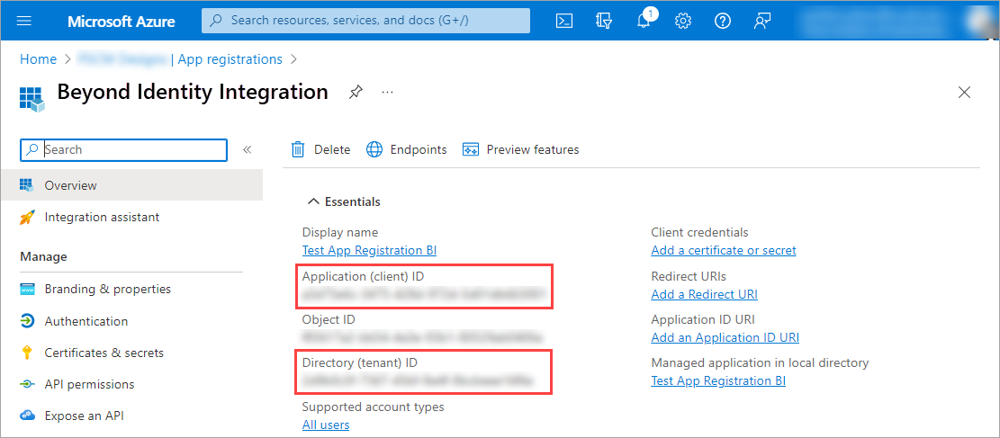

### Add API permissions

1. Under **Manage**, select **API permissions > Add a permission > Microsoft Graph**.  

   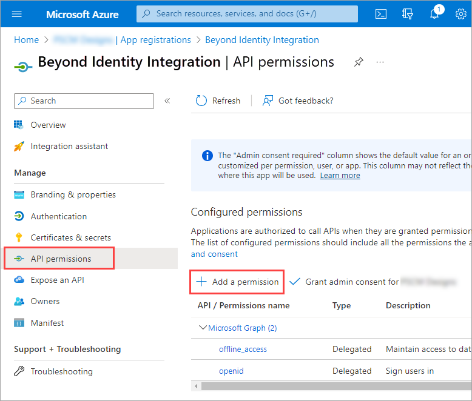

2. Select **Application permissions** and under **Select permissions**, search for **DeviceManagementManagedDevices**.

   Then select, **DeviceManagementManagedDevices.Read.All** .

   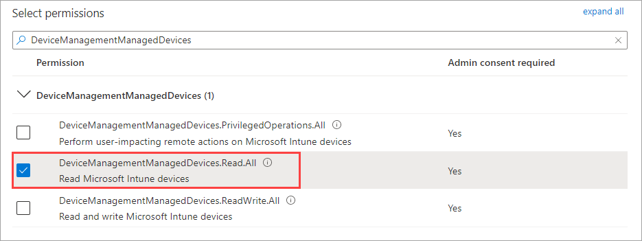

3. Search for **User** and select **User.Read.All**.

4. Select the **Delegated permissions** option.  

   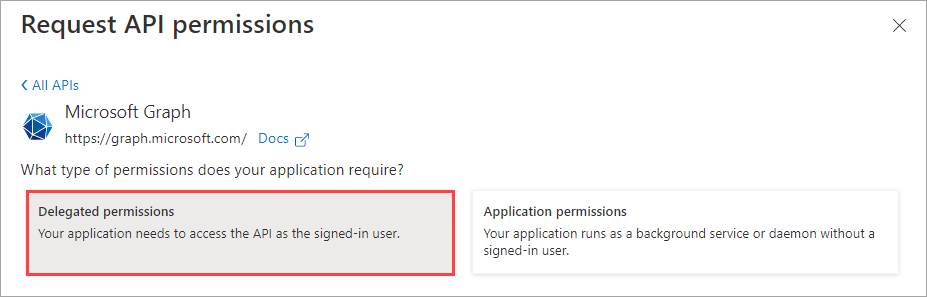

5. Search for **Openid permissions** and select the following options. Then select **Add permissions**.

  * email

  * offline\_access

  * openid

  * profile

6. Select **Grant admin consent for** and select **Yes** to confirm consent.  

  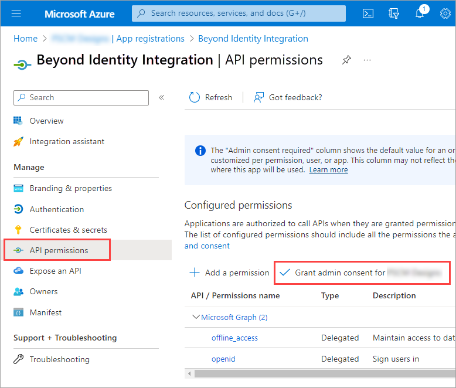

7. Under **Manage**, select **Certificates & secrets > New client secret**.  

  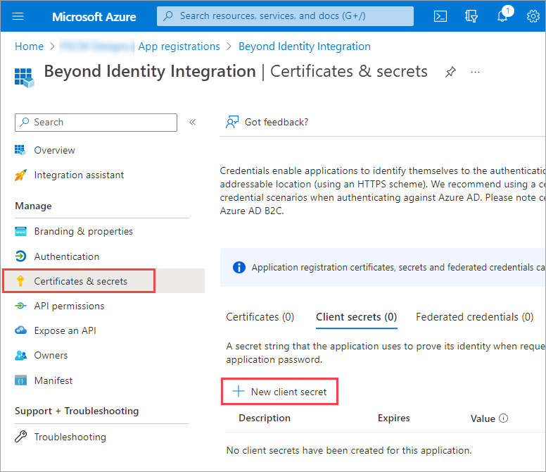

8. Enter a description for the secret, for example, **Beyond Identity Policy Engine**. Then select the duration of the section and select **Add**.

   :::info Important    
   Note the expiration time because you’ll need to reset this before it expires.
   :::

9. Copy the secret’s **Value** for use in the Beyond Identity Admin Console in the next step. This secret value is never displayed again after you leave this page.  

  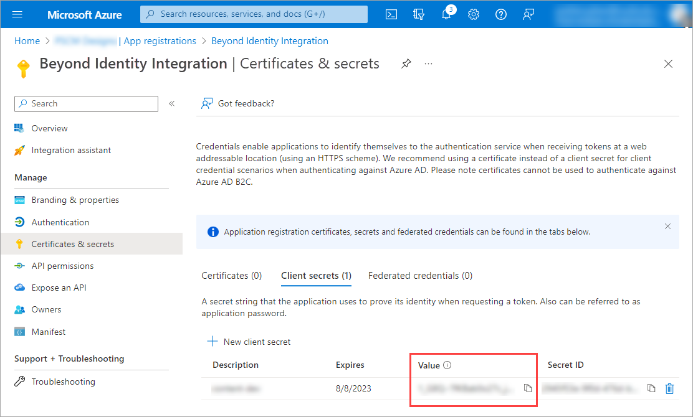

## Step 2: Configure Intune Integration in Beyond Identity

In this step, you’ll install and configure Intune with Beyond Identity. You’ll use the Azure client ID, tenant ID, and secret value you copied and saved earlier.

1. Log in to Beyond Identity Admin Console, under Tenant, go to **Integrations >** **Endpoint Management > Microsoft Intune**. Then click **Install**.  

  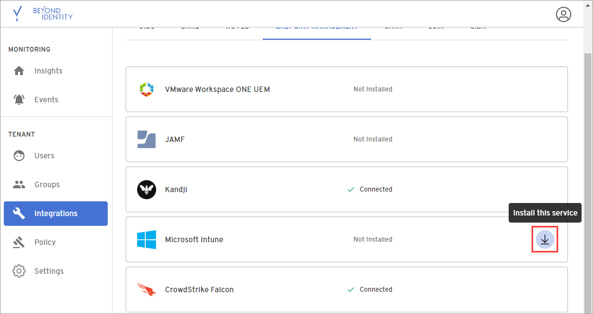

2. Enter the information you copied and saved from the Azure Admin Portal, and then click **Save changes**.

  * Azure Tenant ID

  * Client ID

  * Client Secret

## Step 3: Configure and test MDM Authentication Policy

In this step, you’ll create an authentication policy to determine if the test user has a registered and unregistered device.

1. In the Beyond Identity Admin Console, under **Tenant**, select **Groups > Add Group**, name it **Require Intune on Windows**. Then click **Save Changes**.

2. Select the group you added and select **Add Users**. Then add a test user to the group.

3. Select **Policy > Edit Policy > Add rule**, select the following conditions, and click **Add > Publish changes**.

  * **For any transaction** is set to **Authentication**.

  * **If user** is a member of the **Require Intune on Windows** group.

  * **If device platform is** set to **Windows**.

  * **If Integration is** set to **Intune Registration is Registered**.

  * **Then** action is set to **Deny** the authentication.   

  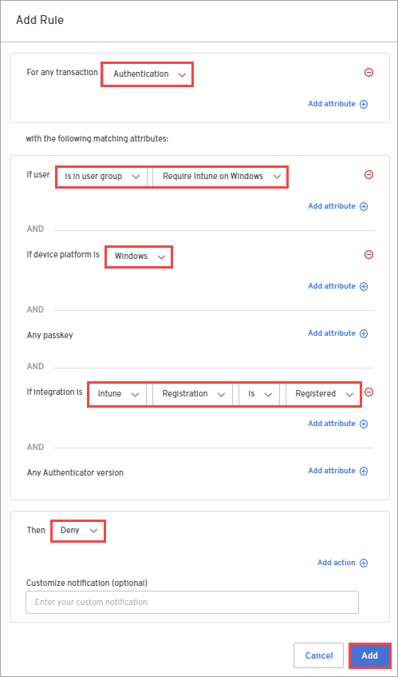

4. From a Windows computer managed with Intune, try authenticating with the test user’s credentials. If authentication is denied, the policy works as expected.

5. Go back to the policy and change the **If Integration is** condition to **Intune Registration is Not Registered, Pending Enrollment**.

6. With the same test user’s credentials, try authenticating again. If authentication is successful, the policy works as expected.

:::tip Checkpoint
At this point, you should have completed the following:

* [x] Registered Beyond Identity in AAD to establish trust with the Microsoft identity platform.
* [x] Installed and configured Intune with Beyond Identity.
* [x] Created an authentication policy in Beyond Identity and used a test user to determine a registered and unregistered device.
:::

## Step 4: Configure and push mobile apps

You’ll configure the mobile apps in Intune to assign your managed app configuration policy in this step.

### iOS

1. Sign in to the [Microsoft Endpoint Manager admin center](https://endpoint.microsoft.com/#home), select **Apps**, and under **Policy**, select **App configuration policies**.

  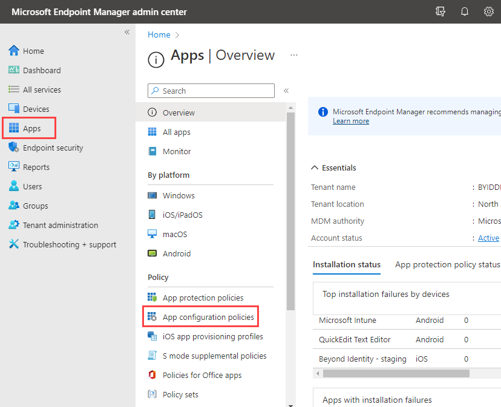

2. Click **Add > Managed devices**.

  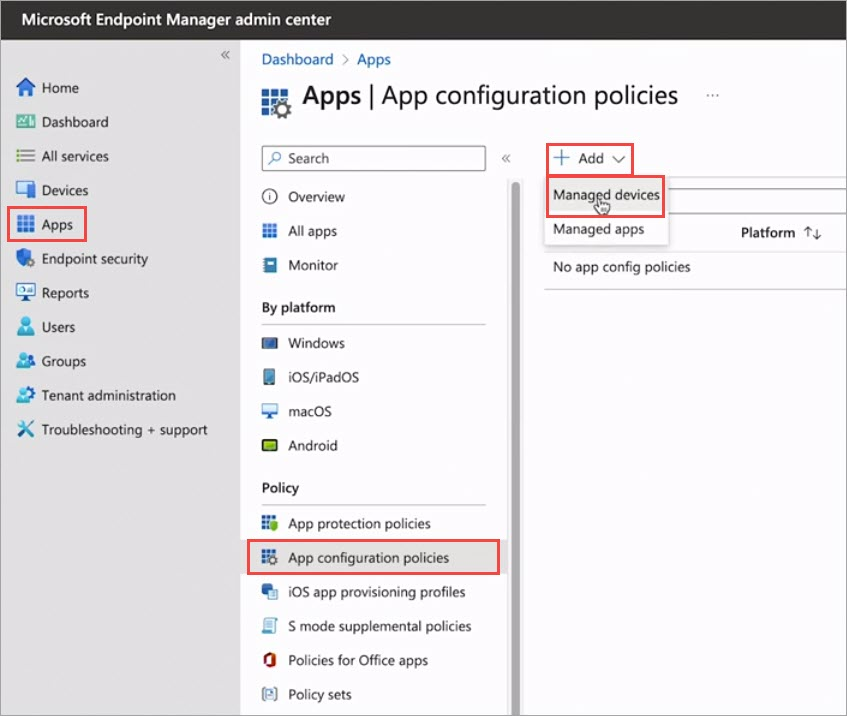

3. On the **Basics** page, provide a name for the policy, select **iOS/iPadOS**, and click **Select app**

  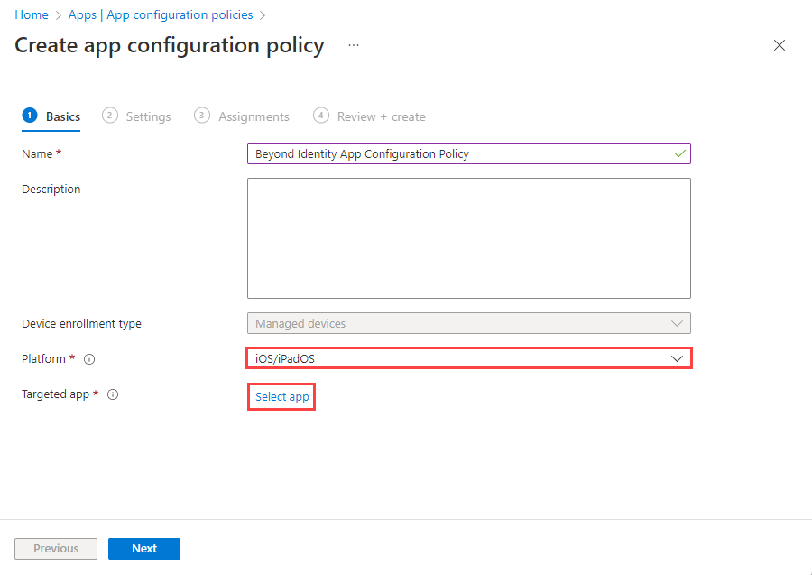

4. Select the Associated app and click **Next**.

5. On the **Settings** page, select **Use configuration designer**, enter the following configuration key-value pairs. Then click **Next**.

  :::info note
  The configuration keys are case-sensitive.
  :::

  | Configuration key | Value type | Configuration value |
  | --- | --- | --- | 
  | serialNumber  | String  | {{serialNumber}}  |
  | intuneDeviceID  | String  |  {{deviceid}} |

  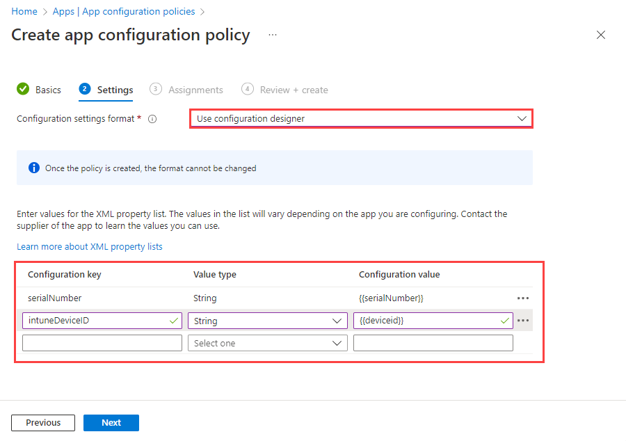

6. Assign the policy to the desired groups or users, click **Next**, and click **Create** to add the app configuration policy to Intune.

### Android

1. Sign in to the [Microsoft Endpoint Manager admin center](https://endpoint.microsoft.com/#home), select **Apps**, and under **By Platform**, select **Anroid**.

  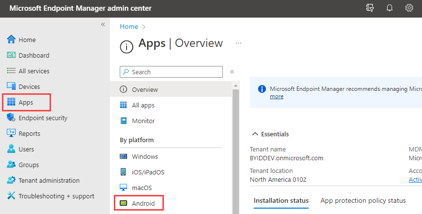

2. Click **Add > Managed Google Play app > Select**.

  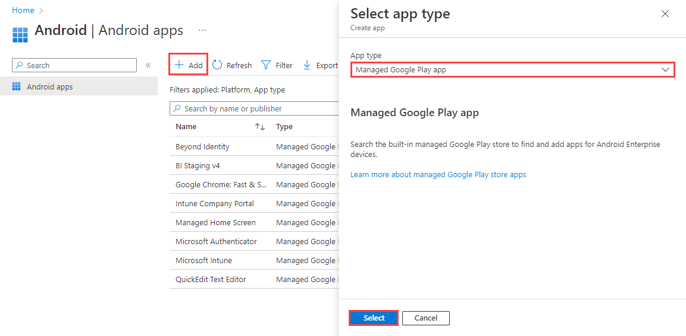

3. Search for **beyond identity** and select it.

  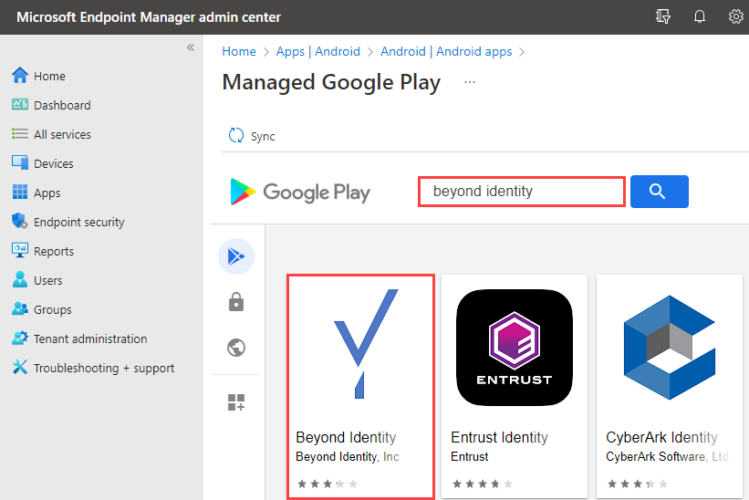

4. Click **Select** to approve it.

  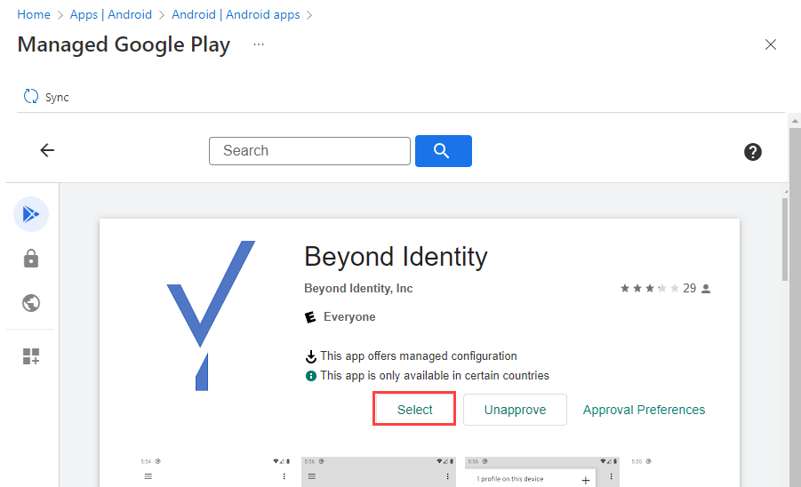

5. Click **Apps**, under **Policy**, select **App configuration policies**.

  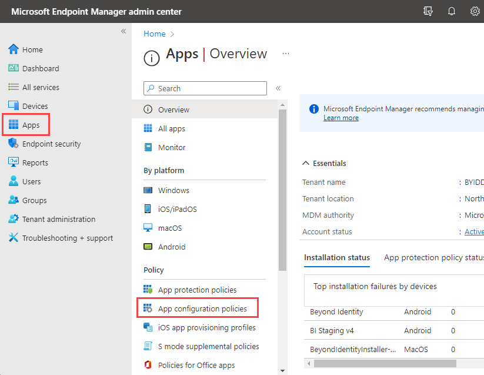

6. Click **Add > Managed devices**.

  

7. On the **Basics** page, provide a name for the policy, select the following:

  * Platform: **Android Enterprise**
  * Profile Type: **Fully Managed, Dedicated, and Corporate-Owned Work Profile Only**

  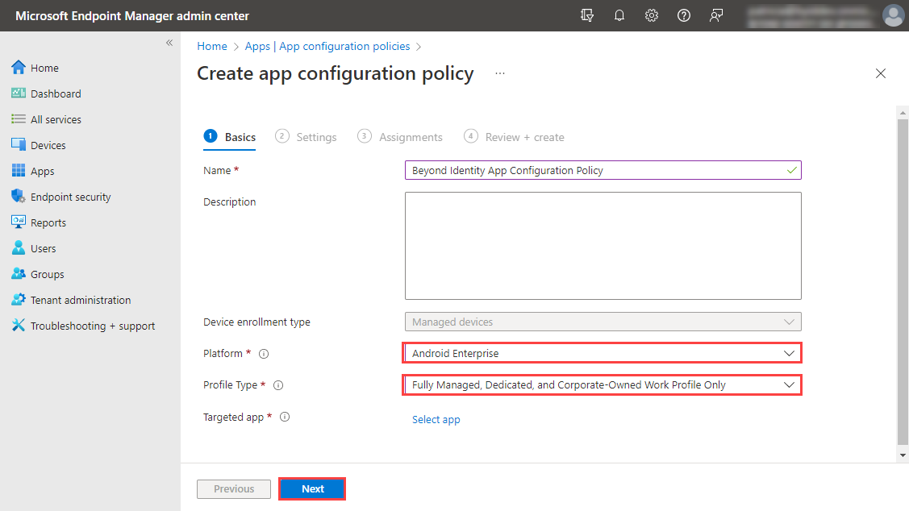

8. Click **Select app** and for the Associated app, select **Beyond Identity**, click **OK**, and click **Next**.
9. On the **Settings** page, select **Use configuration designer**, and click **Add**.
10. Select **Intune Devide ID** click **OK**. Then enter **{{deviceid}}** for the **Configuration value** and click **Next**.  

  :::info    
  The configuration keys are case-sensitive.
  :::

  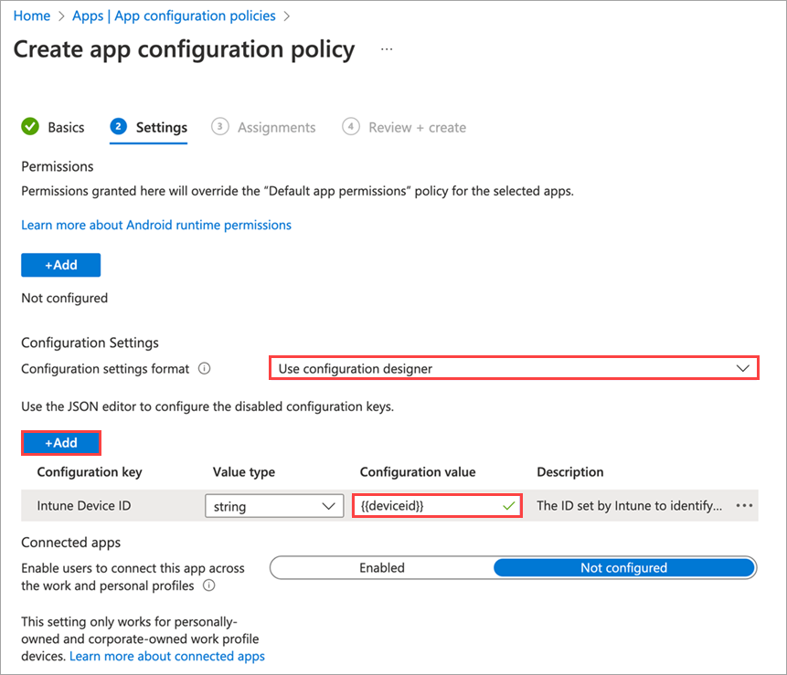

  Assign the policy to the desired groups or users, click **Next**, and click **Create** to add the app configuration policy to Intune.
