This guide provides information on how to:

- Set up Beyond Identity as a passwordless authentication solution for your Okta environment.

- Set up Okta to use Beyond Identity as an Identity Provider.

## Prerequisites

Ensure that you have the following:

- An Okta account with **Super** or **Organization** admin privileges to add or edit: 

  - Attributes and their mappings in **Directory &gt; Profile Editor**.

  - Identity Providers in **Security &gt; Identity Providers**.

  - Routing rules in **Security &gt; Identity Providers &gt; Routing Rules**.

  - Event Hooks in **Workflow &gt; Event Hooks**. This is optional.

- **OpenID Connect IdP** enabled for the account.  Test that **OpenID Connect IdP** is enabled by verifying you have *Security &gt; Identity provider &gt; Add Identity Provider &gt; Add OpenID Connect IdP* available. If not, contact Okta to open a support ticket to enable it. For a template of the ticket, see [Submit ticket to have OIDC connections enabled](#submit-ticket-to-have-oidc-connections-enabled).

- **Routing Rules** tab is available on the **Security &gt; Identity Providers** page. If it's missing, contact Okta to open a support ticket to have it enabled.

## Beyond Identity information

#### Information you'll <u>provide</u> to the Beyond Identity field team

<table width="100%">
  <tbody>
    <tr>
      <td width="50%">
        
Your Company Name

      </td>
      <td width="50%">
        
&nbsp;

      </td>
    </tr>
    <tr>
      <td>
        
Your Okta Instance URL

        
For example, https://[your domain].okta.com

      </td>
      <td>
        
&nbsp;

      </td>
    </tr>
    <tr>
      <td>
        
Your Okta API Token for Beyond Identity

        

          For assistance with creating a new API token in Okta, see Appendix
          A.
        

      </td>
      <td>
        
&nbsp;

      </td>
    </tr>
    <tr>
      <td>
        
Beyond Identity Admin Portal Application credentials

        
SSO Client ID

        
SSO Client Secret

      </td>
      <td>
        
&nbsp;

      </td>
    </tr>
    <tr>
      <td>
        
Beyond Identity User Portal Application credentials

        
SSO Client ID

        
SSO Client Secret

      </td>
      <td><em>This will be updated by the customer directly in Beyond Identity Admin UI.</em>
      </td>
    </tr>
    <tr>
      <td>
        
(Optional) A logo for your corporation

        
Logo requirements:

        <ul>
          <li>300 x 150 pixels or less</li>
          <li>File size of 10kb or less</li>
          <li>File types accepted: SVG, PNG, JPG, or GIF</li>
        </ul>
      </td>
      <td>
        
&nbsp;

      </td>
    </tr>
  </tbody>
</table>

#### Information you'll <u>receive</u> from the Beyond Identity field team

<table width="100%">
    <tr>
      <td width="50%">
        
Beyond Identity IdP endpoint URLs

      </td>
      <td width="50%">
        
&nbsp;

      </td>
    </tr>
    <tr>
      <td>
        
Client ID

        
[From Beyond Identity Console]

      </td>
      <td>
        
&nbsp;

      </td>
    </tr>
    <tr>
      <td>
        
Client Secret

      </td>
      <td>
        
[From Beyond Identity Console]

      </td>
    </tr>
    <tr>
      <td>
        
SCIM / Event Hook API Bearer Token

      </td>
      <td>
        
[From Beyond Identity SE]

      </td>
    </tr>
    <tr>
      <td>
        
Beyond Identity Org ID

        
[From Beyond Identity SE]

      </td>
      <td>
        
&nbsp;

      </td>
    </tr>
    <tr>
      <td>
        
Event Hook API endpoint

      </td>
      <td>
        
https://api.byndid.com/okta_events

      </td>
    </tr>
    <tr>
      <td>
        
SCIM API endpoint

      </td>
      <td>
        
https://api.byndid.com/scim/v2/Users

        
https://api.byndid.com/scim/v2/Groups

      </td>
    </tr>
</table>

## Okta configuration

 To configure Beyond Identity as the IdP in Okta, follow the steps below. Once done, you'll be ready to enable Beyond Identity for test users.

### Step 1: Add custom attribute to Okta user profile
*This is doing more than navigate to the profile editor. What exactly is the end result of this section? What are they going in this step?*

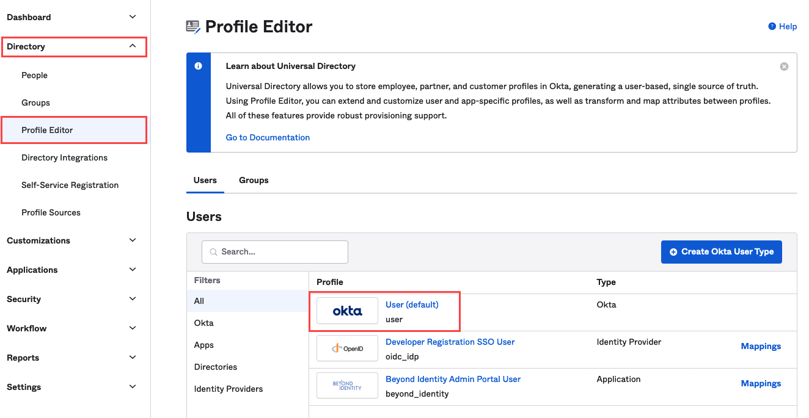

1. Sign into the Okta portal as an administrator and, under the main Okta menu, select **Directory > Profile Editor**.

2. Under **Users**, find your **Okta** profile and select **User (default)**.

3. At the bottom of the user profile editor, click **Add Attribute**.  

  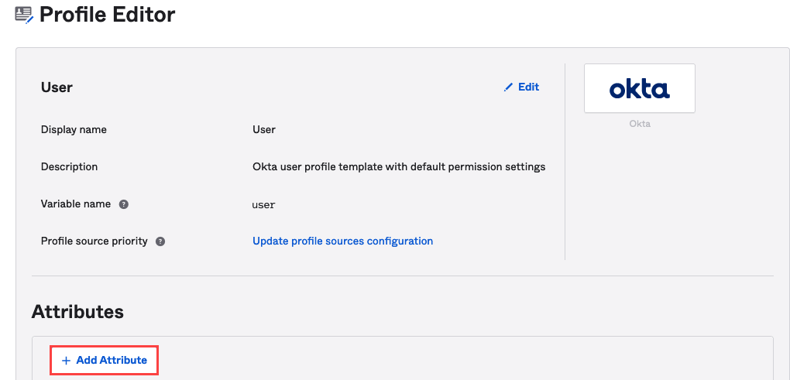 

4. Select the fields as shown in the following image. Then click **Save**. 

  - Data Type: **boolean**

  - Display Name: **Beyond Identity Registration Status**

  - Variable Name: **byndidRegistered**

  - Description: **Beyond Identity Registration Status**

   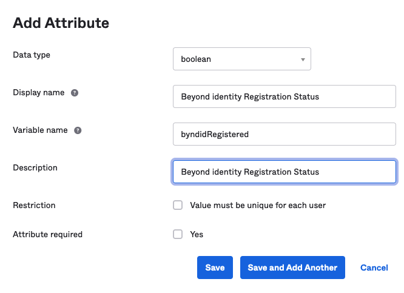 

5. If you have multiple profile masters (applicable for AD mastered users), perform the following steps. 

   1. Edit the **byndidRegistered** attribute in Okta profile.

   2. For the **Source Priority** field, select **Inherit from Okta** from the drop-down menu.

   3. Click **Save Attribute**.

   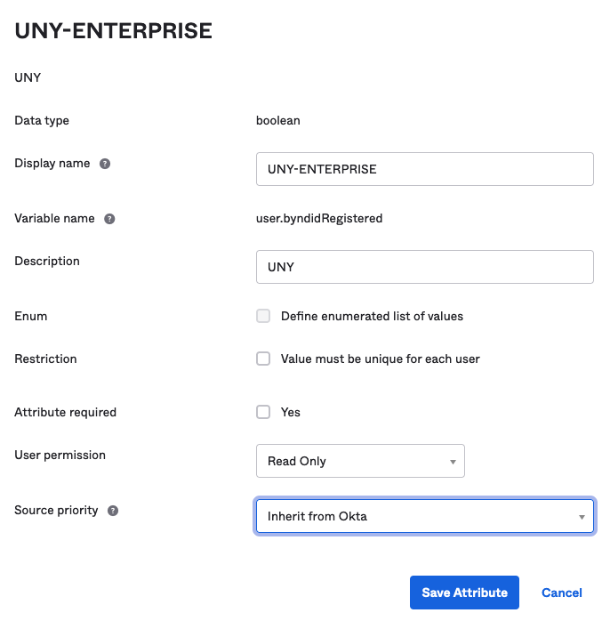

### Step 2: Add Beyond Identity User Group

1. Under the Okta menu, select **Directory &gt; Group > Add Groups**.

2. Enter the following and click **Add Group**. 

  - Name: **Beyond Identity**

  - Description: **Beyond Identity Users Group**

  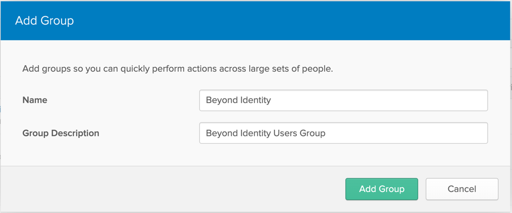

### Step 3: Set up the Beyond Identity Admin Application in Okta 

1. Click **Applications &gt; Browse App catalog**.

2. In the Search window, enter **Beyond Identity Admin**.

3. Select the **Beyond Identity Admin Portal** app and click **Add**.  

  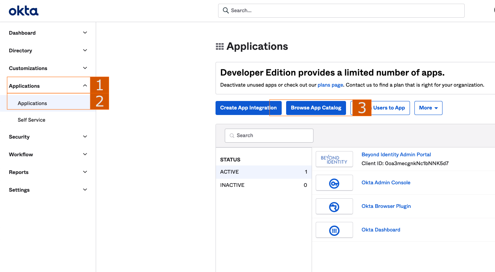 

4. Under **General Settings**, update the **Application Label** field with **Beyond Ideneity Admin Portal**. Then click **Done**.

5. In the **Assignment** tab, assign **Admins** to this application.

6. In the **Sign On** tab, click **Edit**, and update the following with the information provided by Beyond Identity: 

  - Org ID

  - Client ID

  - Client Secret

### Step 4: Setup Admin Portal Access

1. Provide the **Client ID** and **Client Secret** assigned to the admin UI application in Okta to Beyond Identity SE. The Beyond Identity team will collect and configure this value.

2. **Beyond Identity Field Team:** Configure the following fields through Beyond Identity Support Console while updating the Admin Console Configuration. 

  - Name: **Okta OIDC Integration**

  - Client ID: *Use the value recorded in the previous step*

  - Client Secret: *Use the value recorded in the previous step*

  - Issuer: https://*&lt;okta-tenant-id&gt;*.okta.com (Provided by the customer as Login URL)  **TIP**  For custom domain names, replace *&lt;okta-tenant-id&gt;*.okta with your domain. For example, *sso.&lt;domain&gt;*.com.

  - Token Field: **sub**

  - Token Field Lookup: **external\_id**

  After provisioning, the customer should log in and confirm that the admin has access to Beyond Identity Console.

### Step 5: Setup Beyond Identity User Portal Application in Okta 

1. Click **Applications &gt; Browse App Catalog**.

2. In Search window, enter **Beyond Identity User**.

3. Select **Beyond Identity User Portal** app.

4. Click **Add**.  

   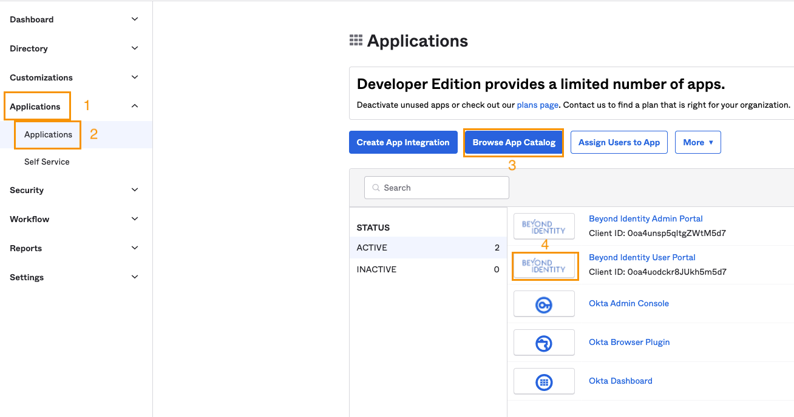

5. A dialog displays the general settings and the application label. Click **Done**.

6. In the Assignment Tab, click **Assign** and from the drop-down the select **Assign to Groups**.

7. Click **Assign** for the Beyond Identity group.

8. In the **Sign On** tab, click **Edit**, update **Org ID** with the information provided by Beyond Identity.

9.  Copy the **Client ID** and **Client Secret**. You'll use this later in the configuration.

10. In the **Provisioning** tab, click **Configure API Integration &gt; Enable API Integration**.

11. In the API token field, paste the API token provided by Beyond Identity, and click **Test API Credentials**. Then, after you see the *Beyond Identity User Portal was verified Successfully* message, click **Save**.

12. In the **Provisioning to App** section, click **Edit**, and enable the following. Then click **Save**. 

  - Create Users

  - Update User Attributes

  - Deactivate Users

  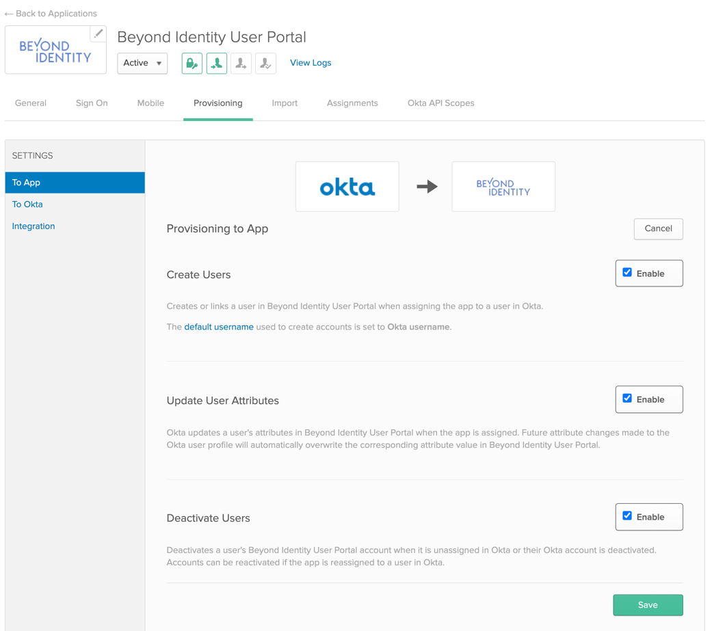 

13. For Okta production instances, in the **Provisioning** tab, click **Edit &gt; Integration**, select the **Import Groups** checkbox. Then click **Save**.  

    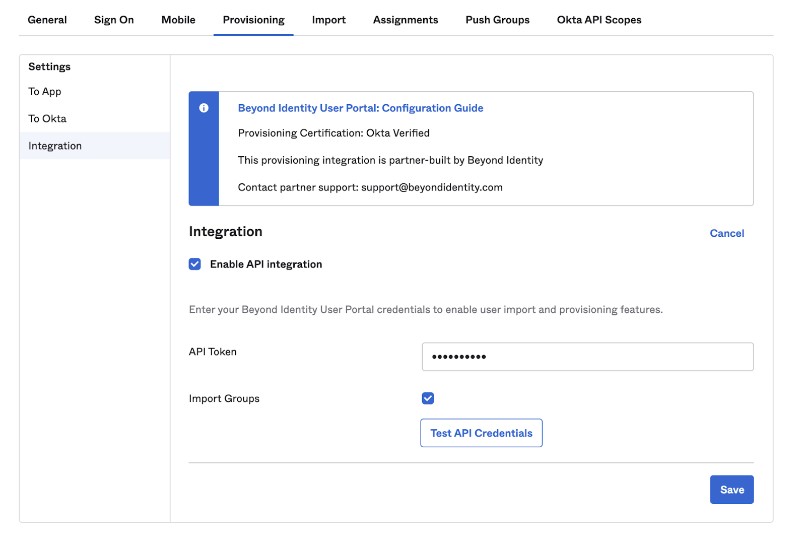 

14. Sync groups with Beyond Identity: 

    1. Click the **Push Groups** tab.

    2. Select the **Push Groups** drop-down menu.

    3. Select **Find groups by name** to define which groups are synced with Beyond Identity.  

    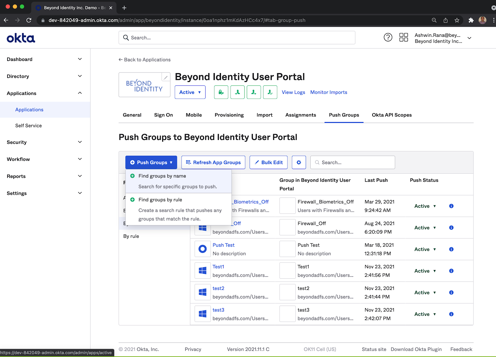 

## Beyond Identity configuration

### Step 1: Set up the Beyond Identity User Console Authentication 

1. Log into the Beyond Identity Admin Console and click **Settings &gt; Console Login&gt; User Console SSO Integration**.

2. Click **Add OIDC SSO** and configure the following fields for the User Console SSO Integration. Then click **Save Changes**. 

  - Name: **Okta OIDC Integration**

  - Client ID: *Use the value recorded in the previous step*

  - Client Secret: *Use the value recorded in the previous step*

  - Issuer: https://*&lt;okta-tenant-id&gt;*.okta.com (Provided by the customer as Login URL)  

   :::tip 
   For custom domain names, replace *&lt;okta-tenant-id&gt;*.okta with your domain. For example, *sso.&lt;domain&gt;*.com.
   :::

  - Token Field: **sub**

  - Token Field Lookup: **external\_id**

   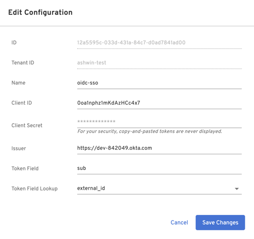 

### Step 2: Setup Beyond Identity Console for User Authentication 

1. Log into the Beyond Identity Admin Console and click the **Integrations** tab, and click **OIDC**.

2. Click **Add OIDC Client**, and enter the following information. Then click **Save Changes**. 

  - Name: **Okta SSO**

  - Redirect URIs: https://&lt;*okta-tenant-name*&gt;.okta.com/oauth2/v1/authorize/callback  

   :::tip
   You can add multiple Redirect URIs using a comma between the URLs.
   :::

  - Token Signing Algorithm: **RS256**

  - Auth Method: **Client\_secret\_post**

3. Select the OIDC created above and copy the **Client ID** and **Client Secret** values. You'll use these values in the next step.  

   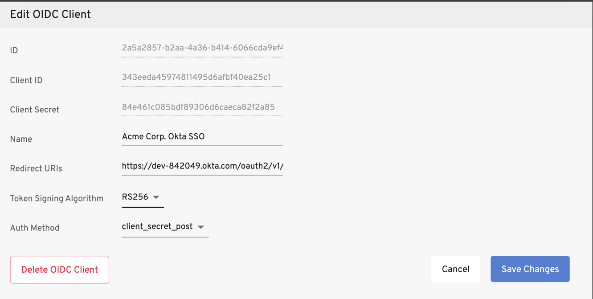 

4. Click the **Integrations** tab, click **API Extensions**, and click **Install** for the Okta Registration Attribute.  

   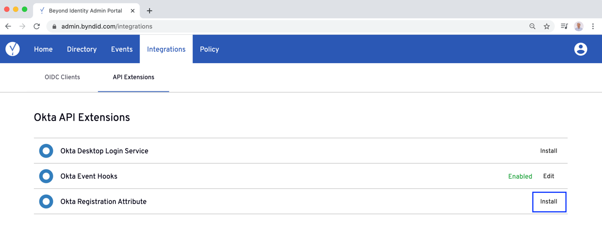 

5. Enter the following information for your tenant. Then click **Save Changes**. 

  - Okta Domain

  - Okta API Token

  - Okta Registration Attribute  Enter **byndidRegistered** or the value chosen by your organization mentioned earlier in this guide.

  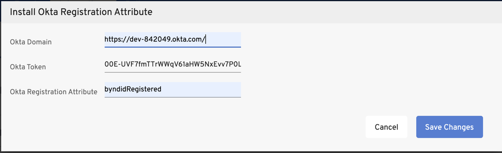 

### Step 3: Configure Beyond Identity as the Identity Provider

1. In the main Okta menu, select **Security &gt; Identity Providers**.

2. In the Identity Providers tab, click **Add Identity Provider**.

3. Select **Add OpenID Connect IdP**.  **NOTE**  This option will not be available in Okta until it's enabled or the ticket mentioned earlier gets resolved.

4. Enter the following information. 

  - Name: **Beyond Identity**

  - Client ID: *From the Beyond Identity Admin Console*

  - Scopes: **openid**Remove any additional scopes listed.

  - Issuer: **https://auth.byndid.com/v2**

  - Authorization endpoint: **https://auth.byndid.com/v2/authorize**

  - Token endpoint: **https://auth.byndid.com/v2/token**

  - JWKS endpoint: **https://auth.byndid.com/v2/.well-known/jwks.json**

  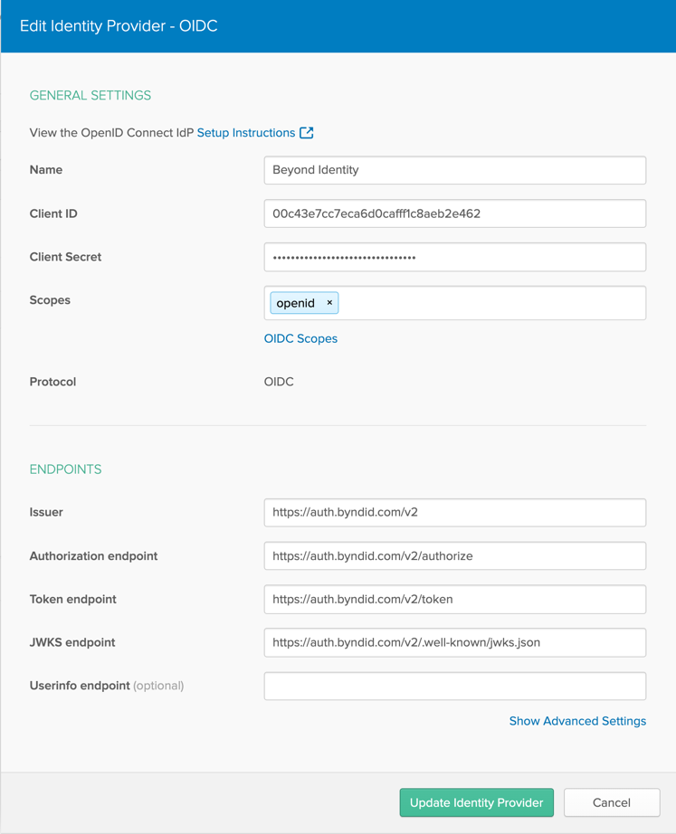 

5. Click **Show Advanced Settings**, enter the following information, and click **Update Identity Provider**. 

  - IdP Username: **idpuser.externalId**

  - Match Against: **Okta Username**

  - Account Link Policy: *Leave as the default option*

  - Auto-link: *Leave as the default option*

  - If no match is found: **Redirect to Okta Sign-in Page**

6. (Optional) If you don't have SCIM cabability enabled, you can 

### Step 4: (Optional) Set up Event Hooks in Okta

The Event Hooks configuration is only required if you do not have SCIM capability enabled for your Okta tenant due to licensing restrictions.

1. In Okta Admin Portal, Click on **Workflow &gt; Event Hooks**.

2. Select **Create Event Hook** and update the following information. Then click **Verify**. 

  - Name: **Beyond Identity Provisioning flow**

  - URL: **https://api.byndid.com/okta\_events**

  - Authentication field: **Authorization**

  - Authentication Secret: *The Bearer token provided by the Beyond Identity*.

  - Subscribe to events: 

    - **User Added to Group**

    - **User Removed from Group**

    - **User suspended**

    - **User unsuspended**

3. Click **Save &amp; Continue**. Then click **Verify**.  

   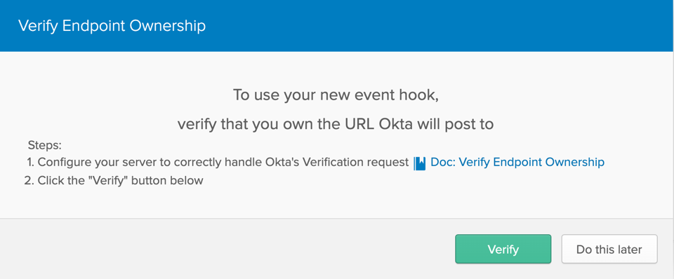

### Step 5: (Optional) Set up Event Hooks in Beyond Identity

The Event Hooks configuration is only required if you do not have SCIM capability enabled for your Okta tenant due to licensing restrictions. Following changes are required in Beyond Identity Admin UI to enable Okta Event Hooks.

1. Click **Integrations &gt; API Extensions**.

2. Enter the information for the Okta Domain and Okta API Token for your tenant.

3. Update the Okta Group Name to **Beyond Identity** or the value chosen by your organization.

4. Click **Save Changes**.  

   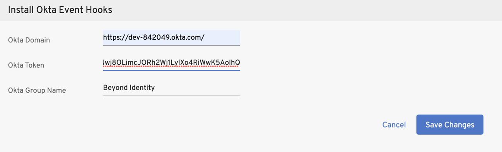

### Step 11: Set up Routing Rules

1. Click **Security &gt; Identity Providers &gt; Routing Rules**.  

   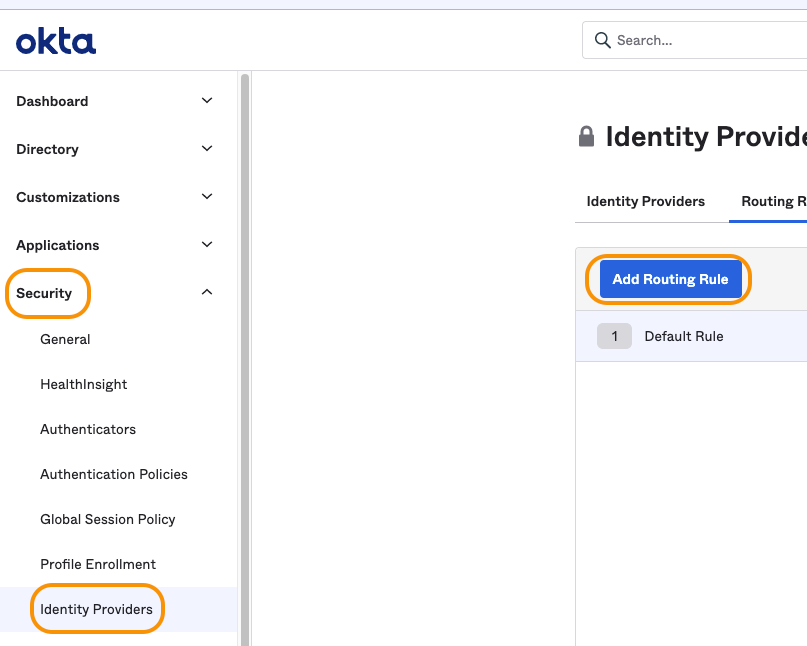 

2. Click **Add Routing Rule** and set the following parameters: 

  - Rule Name: **Beyond Identity Auth**

  - If User IPs: *Leave blank*

  - And Device Platform: *Leave blank*

  - And Application: *Leave blank*

  - And User matches: **User Attributes**  

    **byndidRegistered Equals true**

    :::info
    These values are case sensitive, for example, **True** won't work but **true** will.
    :::

  - Then Use this identity provider: **Beyond Identity**

3. Click **Save and Activate Rule** to set this as your first rule.  

   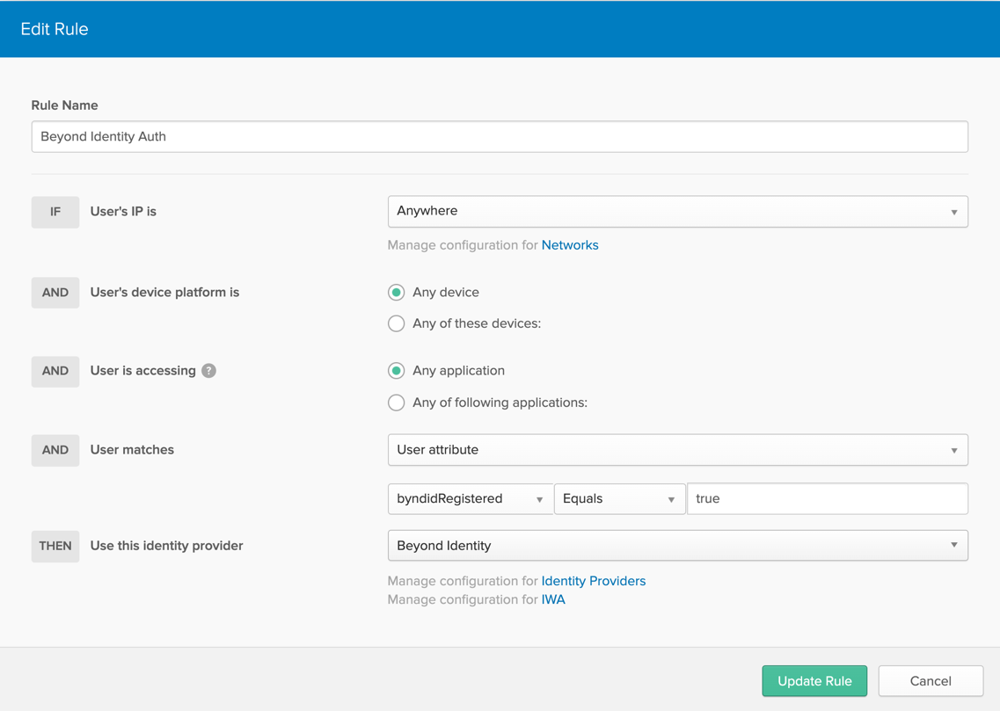 

## Set up Test Users

### User Enrollment

You'll enroll a user in the Beyond Identity experience by assigning them to the **Beyond Identity** group.

1. Click **Directory &gt; Groups**.

2. Select the **Beyond Identity** group.

3. Click **People Box** and click the user want to add to group.

4. Click **Assing People &gt; Beyond identity User Portal**. Then click **Save**.  

  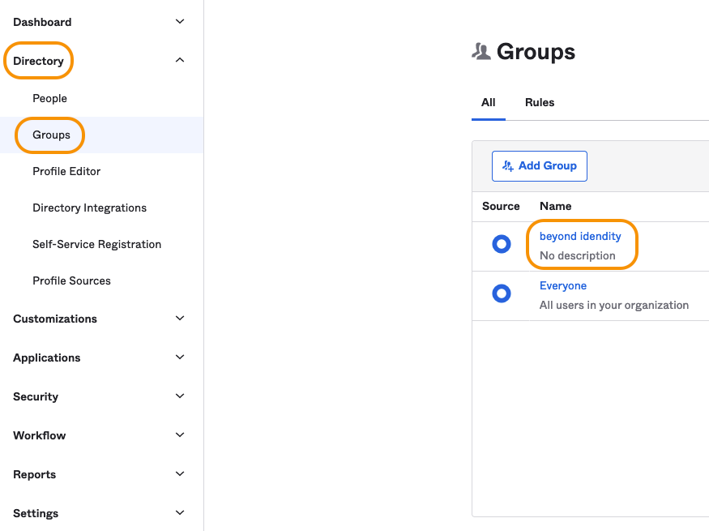 

  Enrolled users will receive an email from Beyond Identity welcoming them to the new Identity Provider.

  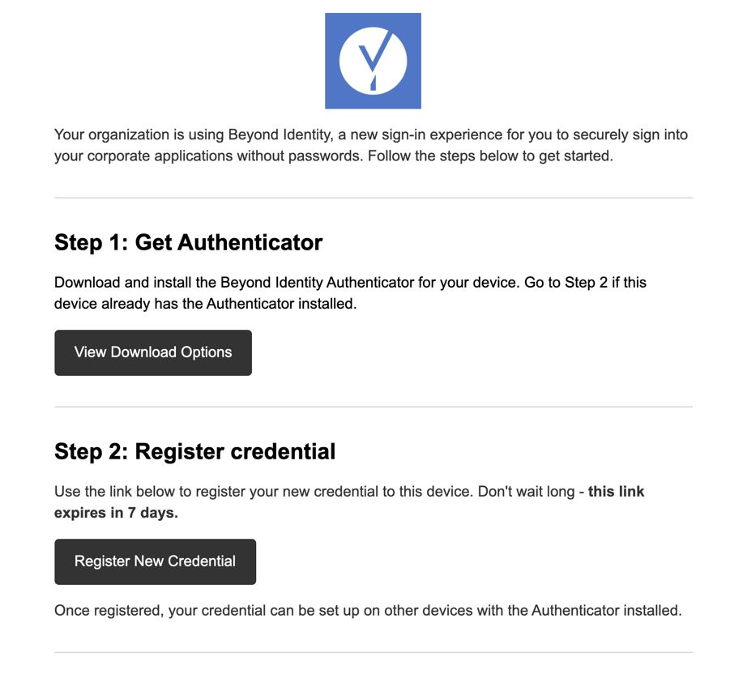

  Each enrolled user is prompted to follow the two steps below:

  - **Step 1:** Download the Beyond Identity Authenticator to their device.  When the user clicks **View Download Options**, the Beyond Identity Authenticator downloads page will open in a browser with all supported platforms displayed. The user should download and install the Beyond Identity Authenticator on their device if they still need to install it.

    Now that the user has the Authenticator installed on their device, they should proceed to Step 2, as there is yet to be a user credential associated with it.

  - **Step 2:** Register their Credential in the Beyond Identity IdP.  By clicking on Step 2 **Register New Credential**, the user’s credential gets enrolled in the Beyond Identity service on the back end. On the front end, when users click Step 2, it takes them to the Beyond Identity Authenticator, where they will see the progress of their credential registration. Once completed, the user will see the credentials in the Authenticator.

    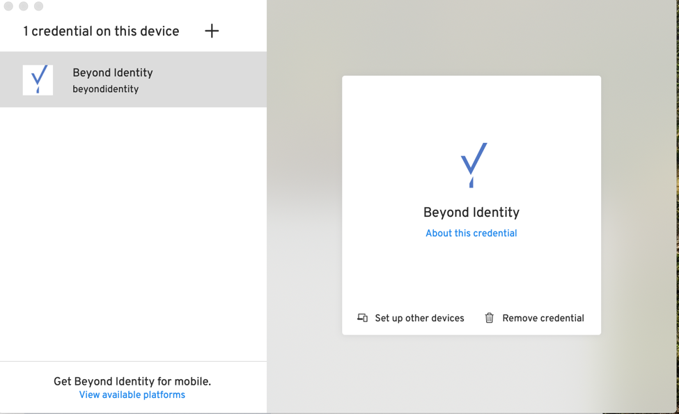 

### User Authentication (Signing in) workflow

Each enrolled user can visit their Okta instance or any application supported by your SSO to sign into their corporate applications.

1. The Okta application or SSO-supported application will ask the user to enter their username.

2. Once the username is submitted, a prompt to use or open the Beyond Identity app for authentication will display for the user.

3. The user should click affirmatively on the prompt to be signed into their application without using a password. The Beyond Identity app, along with a success notification, displays.  **NOTE**  For iOS devices, some application sign-in processes will ask the user to exit the Beyond Identity Authenticator to return to their app after successful authentication.
    
     

## User Deprovisioning

 You can de-provision a user from the Beyond Identity experience by removing them from the **Beyond Identity** group.

1. Click **Directory &gt; Groups**.

2. Select the **Beyond Identity** group.

3. Click **Manage People** and, under the **Members** column, click the minus (-) next to the user you want to remove from the group.

4. Click **Save**.

## Create a Token in Okta

 The following image is an example of an administrator view in Okta and illustrates the actions listed below:

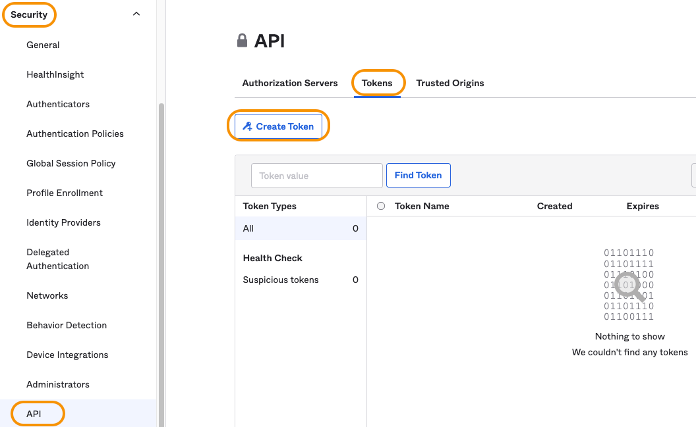

1. Sign into the Okta portal as an administrator.

2. In the main menu bar for Okta, select **Security**.

3. Select **API** from the **Security** drop-down list.

4. Select the **Tokens** tab, click **Create Token**, and enter the name for the token. For example, **Beyond Identity**.

 

## Submit ticket to have OIDC connections enabled 

 The following is an example of how to open a case with Okta requesting them to enable OpenID IDP Connections in Okta Sandbox and Production environments.

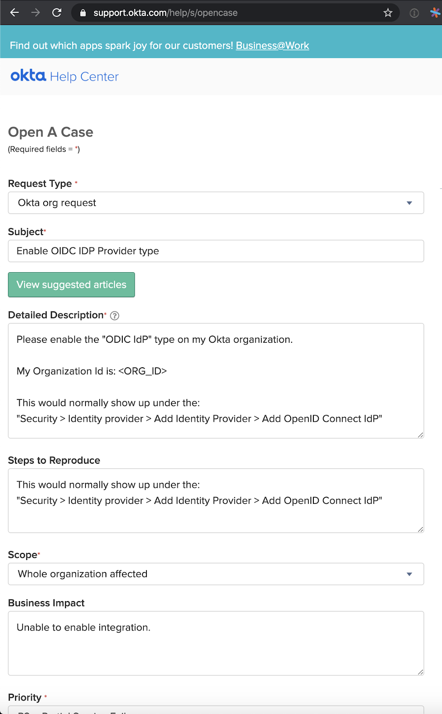

1. Navigate to Okta’s Open Case Center.

2. Create a case with the following information: 

  - Request Type: **Okta org request**

  - Subject: **Enable OIDC Provider Type**

  - Detailed Description, for example:  

    *Please enable the "ODIC IdP" type on my Okta organization.*   
    *My Organization Id is: &lt;ORG\_ID&gt;*   
    *This would normally show up under:*   
    *"Security &gt; Identity provider &gt; Add Identity Provider &gt; Add OpenID Connect IdP"*

  - Steps to reproduce, for example:  

    *This would normally show up under:*   
    *"Security &gt; Identity provider &gt; Add Identity Provider &gt; Add OpenID Connect IdP"*

  - Scope: **Whole organization affected**

  - Business impact, for example:  

    *Unable to enable integration*

  - Priority: **P3 - Non-critical issue**

  - Okta org: Select from the list the organizations where Beyond Identity will be integrated.

  - Case email: Your own email

  - Phone number: Your phone number

  - Add contact to team: &lt;Can be left empty&gt;

  - Add attachment: &lt;Not required&gt;